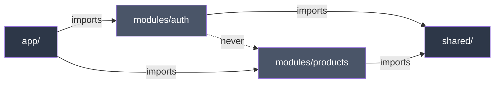

# Architecture Overview

The `docs/ARCHITECTURE.md` file is an **optional** configuration that customizes how agents generate and review code in your project. When present, all agents follow its patterns. When absent, agents use generic best practices for your framework.

::: tip Optional
During `specialist-agent init`, you choose whether to install the architecture guide. You can always add it later by copying from your framework pack to `docs/ARCHITECTURE.md`.
:::

## How It Works

1. During `init`, choose to install `docs/ARCHITECTURE.md` (or skip it)
2. Agents check if the file exists before every action
3. If found, they follow its patterns for code generation and review
4. If not found, they use generic best practices
5. Edit the file anytime to change agent behavior — no restart needed

## Universal Pattern

All framework packs follow the same four-layer architecture:


| Layer | Does | Does NOT |
|-------|------|----------|
| **Service** | HTTP calls | try/catch, transformation, logic |
| **Adapter** | Parse API ↔ App (snake_case → camelCase) | HTTP, side effects |
| **Logic** | Orchestrate service + adapter + state | Render UI |
| **State Store** | Client state (UI, filters, preferences) | Server state, HTTP |
| **Component** | UI + composition | Heavy business logic |

### Framework Equivalents

Each framework has its own terminology for the same concepts:

| Layer | Vue | React | Next.js | SvelteKit | Angular | Astro | Nuxt |
|-------|-----|-------|---------|-----------|---------|-------|------|
| **Logic** | Composable | Hook | Hook / Server Action | Load function | Service + inject() | Endpoint | Composable / useFetch |
| **Client state** | Pinia | Zustand | Zustand | Svelte stores | Signals | — | Pinia / useState |
| **Server state** | TanStack Vue Query | TanStack React Query | TanStack + RSC | SvelteKit load | HttpClient | — | useFetch / useAsyncData |
| **Component** | SFC (.vue) | JSX (.tsx) | JSX (.tsx) | .svelte | Standalone component | .astro / Islands | SFC (.vue) |

## Modular Structure

Every feature is a self-contained module:

```text
src/modules/[feature]/
├── components/     ← UI
├── logic/          ← Orchestration (hooks, composables, load functions)
├── services/       ← Pure HTTP (no try/catch)
├── adapters/       ← Parsers (API ↔ App)
├── stores/         ← Client state only
├── types/          ← .types.ts (API) + .contracts.ts (App)
├── views/          ← Pages
├── __tests__/      ← Tests
└── index.ts        ← Barrel export (public API)
```

## Import Rules



- **Modules → Shared**: Allowed
- **Modules → Modules**: Never (move shared code to `shared/`)
- **App → Modules**: Router and registration only

## Naming Conventions

### Files

| Type | Pattern | Example |
|------|---------|---------|
| Directories | `kebab-case` | `user-settings/` |
| Components | `PascalCase` | `UserSettingsForm` |
| Views / Pages | `PascalCase` | `MarketplaceView` |
| Logic (hooks, etc.) | `use` + `PascalCase.ts` | `useProductsList.ts` |
| Services | `kebab-case-service.ts` | `products-service.ts` |
| Adapters | `kebab-case-adapter.ts` | `products-adapter.ts` |
| Types | `kebab-case.types.ts` | `products.types.ts` |
| Contracts | `kebab-case.contracts.ts` | `products.contracts.ts` |

### Code

| Type | Pattern | Example |
|------|---------|---------|
| Variables / functions | `camelCase` | `getUserById`, `isLoading` |
| Types / Interfaces | `PascalCase` | `UserProfile`, `Product` |
| Constants | `UPPER_SNAKE_CASE` | `API_BASE_URL`, `MAX_RETRIES` |
| Booleans | `is`/`has`/`can`/`should` | `isLoading`, `hasPermission` |
| Event handlers | `handle` + action | `handleSubmit`, `handleDelete` |

## Key Patterns

- **Stop Prop Drilling**: Use composition patterns native to your framework
- **Utils vs Helpers**: Utils = pure functions, Helpers = functions with side effects
- **Error Handling**: Centralized in the logic layer
- **SOLID**: Each file = 1 responsibility

## Without ARCHITECTURE.md

When no `docs/ARCHITECTURE.md` is present:

- **Agents work normally** — they fall back to generic patterns for your framework
- **@planner** notes the absence and uses generic patterns
- **@builder** generates code using standard framework conventions
- **@reviewer** reviews against general best practices

To add it later:

```bash
# Copy from your installed framework pack
cp node_modules/specialist-agent/packs/{framework}/ARCHITECTURE.md docs/ARCHITECTURE.md
```

## Deep Dive

- [Layers](/guide/layers) — Detailed examples of each layer
- [Components](/guide/components) — Component patterns and composition
- Full reference: `docs/ARCHITECTURE.md` in your project (if installed)
