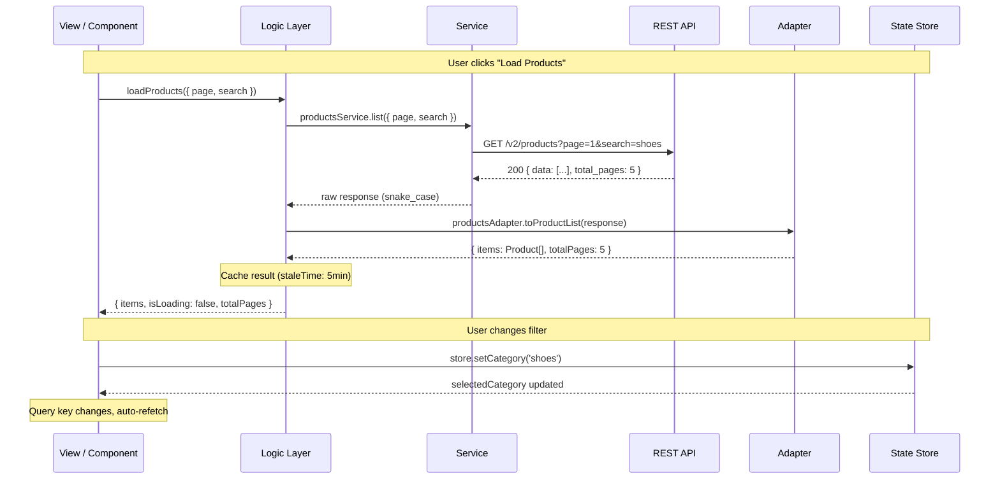
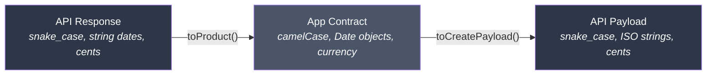
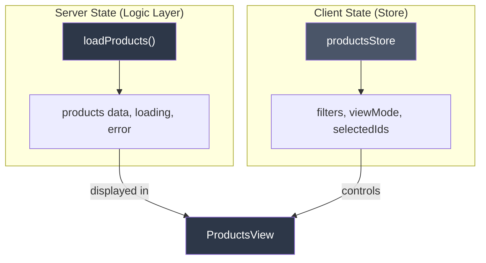

# Responsibility Layers

Each layer in the architecture has a single, well-defined responsibility. All framework packs follow the same layered pattern — only the implementation details differ.

## Complete Request Flow



### Logic Layer by Framework

| Framework | Logic layer | Cache / Server state |
|-----------|-------------|----------------------|
| Vue | Composable (`useXxx`) | TanStack Vue Query |
| React | Hook (`useXxx`) | TanStack React Query |
| Next.js | Hook / Server Action | TanStack + RSC |
| SvelteKit | Load function | Built-in SvelteKit |
| Angular | Service + `inject()` | HttpClient |
| Nuxt | Composable / `useFetch` | Built-in Nuxt |

## Service — Pure HTTP

Services make the HTTP request. Nothing else.

```typescript
// services/products-service.ts
import { api } from '@/shared/services/api-client'
import type {
  ProductListResponse,
  ProductItemResponse,
  CreateProductPayload,
} from '../types/products.types'

export const productsService = {
  list(params: { page: number; pageSize: number; search?: string }) {
    return api.get<ProductListResponse>('/v2/products', { params })
  },

  getById(id: string) {
    return api.get<ProductItemResponse>(`/v2/products/${id}`)
  },

  create(payload: CreateProductPayload) {
    return api.post<ProductItemResponse>('/v2/products', payload)
  },

  update(id: string, payload: Partial<CreateProductPayload>) {
    return api.patch<ProductItemResponse>(`/v2/products/${id}`, payload)
  },

  delete(id: string) {
    return api.delete(`/v2/products/${id}`)
  },
}
```

**Rules:**

- HTTP calls with typed request/response
- One file per domain/resource
- Export as object with methods
- No try/catch (caller handles errors)
- No data transformation (adapter does this)
- No business logic
- No store or logic layer access

::: warning Common mistake
Don't add `try/catch` in services. Error handling belongs in the logic layer (hooks, composables, load functions, etc.).
:::

## Adapter — Contract Parsers

Adapters transform data between API format and app format. They are **pure functions** with no side effects.



```typescript
// adapters/products-adapter.ts
import type { ProductItemResponse } from '../types/products.types'
import type { Product } from '../types/products.contracts'

export const productsAdapter = {
  // Inbound: API → App
  toProduct(response: ProductItemResponse): Product {
    return {
      id: response.uuid,
      name: response.name,
      description: response.description,
      vendor: response.vendor_name,
      category: response.category_slug,
      price: response.price_cents / 100,
      isActive: response.status === 'active',
      imageUrl: response.image_url,
      createdAt: new Date(response.created_at),
      updatedAt: new Date(response.updated_at),
    }
  },

  // Outbound: App → API
  toCreatePayload(input: CreateProductInput): CreateProductPayload {
    return {
      name: input.name,
      description: input.description,
      vendor_name: input.vendor,
      category_slug: input.category,
      price_cents: Math.round(input.price * 100),
      image_url: input.imageUrl,
    }
  },
}
```

**Rules:**

- Pure functions (input → output)
- Bidirectional: API → App (inbound) and App → API (outbound)
- Rename fields (snake_case → camelCase)
- Convert types (string → Date, cents → decimal, status → boolean)
- No HTTP calls
- No store or logic layer access

## Types and Contracts

Two separate files for the same resource:

```typescript
// types/products.types.ts — Exact API response (snake_case)
export interface ProductItemResponse {
  uuid: string
  name: string
  description: string
  vendor_name: string
  category_slug: string
  price_cents: number
  status: 'active' | 'inactive' | 'pending'
  image_url: string | null
  created_at: string       // ISO 8601
  updated_at: string       // ISO 8601
}

export interface ProductListResponse {
  data: ProductItemResponse[]
  total_pages: number
  current_page: number
}
```

```typescript
// types/products.contracts.ts — App contract (camelCase)
export interface Product {
  id: string
  name: string
  description: string
  vendor: string
  category: string
  price: number            // in currency, not cents
  isActive: boolean        // derived from status
  imageUrl: string | null
  createdAt: Date          // Date object, not string
  updatedAt: Date
}
```

::: tip Why two files?
- `.types.ts` mirrors the API exactly — if the API changes, only this file changes
- `.contracts.ts` is what your components actually use — stable app interface
- The adapter bridges the gap between them
:::

## Logic Layer — Orchestration

The logic layer connects everything: calls service, passes through adapter, manages loading/error, and exposes data to the UI.

Each framework implements this differently:

| Framework | Pattern | Example |
|-----------|---------|---------|
| Vue | Composable + Vue Query | `useProductsList()` |
| React | Hook + React Query | `useProductsList()` |
| Next.js | Hook + Server Action | `useProductsList()` / `createProduct()` |
| SvelteKit | Load function | `+page.ts load()` |
| Angular | Service + inject() | `ProductsService` |
| Nuxt | Composable + useFetch | `useProductsList()` |

**Rules (universal):**

- Orchestrate: service → adapter → reactive data
- Manage loading, error, empty states
- Return reactive/observable values (never raw)
- No template/rendering
- No direct API access (service does this)

## Client State Store

Client state is for data that **does not come from the server**: UI preferences, filters, selections.



| Framework | Client state | Server state |
|-----------|-------------|--------------|
| Vue | Pinia | TanStack Vue Query |
| React | Zustand | TanStack React Query |
| Next.js | Zustand | TanStack + Server Components |
| SvelteKit | Svelte stores | SvelteKit load |
| Angular | Signals | HttpClient |
| Nuxt | Pinia / useState | useFetch / useAsyncData |

**Rules (universal):**

- Client state only (UI, filters, preferences, session)
- No server state (API data belongs in the logic layer)
- No HTTP calls
