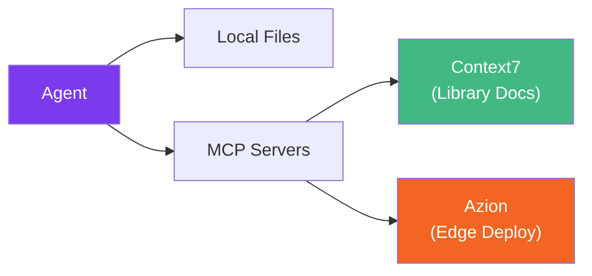

# MCP Integrations

[Model Context Protocol (MCP)](https://modelcontextprotocol.io/) servers extend Claude Code's capabilities by giving access to external tools and data sources. **Specialist Agent works fully without any MCP** - all agents operate using local files and built-in tools. MCPs are optional enhancements.

## What MCPs Add

| MCP | What it does | Who benefits |
|-----|-------------|--------------|
| **Context7** | Fetches up-to-date library documentation | You (the developer) when asking about APIs |
| **Azion** | Generates edge configs, deploys static sites | `@starter` and `@cloud` agents (Edge Mode) |



---

## Context7 - Library Documentation

**What it does:** Fetches up-to-date documentation and code examples for any programming library (Vue 3, React, Pinia, TanStack Query, etc.).

**Who benefits:** Primarily **you, the developer**. When you ask Claude Code about a library API, Context7 provides current docs instead of relying on training data. Agents don't query Context7 automatically - they follow your project's `ARCHITECTURE.md` and local conventions.

**Configuration:**

```json
{
  "mcpServers": {
    "context7": {
      "type": "http",
      "url": "https://mcp.context7.com/mcp"
    }
  }
}
```

::: tip Already Included
Context7 is pre-configured in Specialist Agent's `.mcp.json`. No setup needed.
:::

---

## Azion - Edge Deployment & Configuration

**What it does:** Connects Claude Code to the [Azion Edge Platform](https://www.azion.com/en/documentation/devtools/mcp/), giving agents access to Azion's documentation, code samples, CLI commands, API specs, Terraform configs, and a static site deployment tool.

**Which agents use it:**

- `@starter` - After scaffolding, can generate Azion edge configs and deploy static sites
- `@cloud` - Edge Mode uses Azion MCP tools to generate rules engine configs, Terraform resources, and observability queries

### Available MCP Tools

The Azion MCP exposes **9 tools** - 7 for search/generation and 1 for deployment:

| Tool | Category | What it does |
|------|----------|-------------|
| `search_azion_docs_and_site` | Search | Full-text search across Azion documentation |
| `search_azion_code_samples` | Search | Code samples for edge functions and frameworks |
| `search_azion_cli_commands` | Search | CLI syntax and usage for any operation |
| `search_azion_api_v3_commands` | Search | API v3 endpoints, payloads, examples |
| `search_azion_api_v4_commands` | Search | API v4 endpoints (latest) |
| `search_azion_terraform` | Search | Terraform provider resources and HCL examples |
| `create_rules_engine` | Generator | Generates Rules Engine configs (cache, routing, redirects) |
| `create_graphql_query` | Generator | Builds GraphQL queries for analytics and observability |
| `deploy_azion_static_site` | Deploy | Deploys a static site to Azion Edge |

::: info How it works in practice
For **static sites** (SSG output from Vite, Nuxt, Next.js, SvelteKit), the agent can deploy directly via `deploy_azion_static_site`.

For **dynamic apps** (edge functions, SSR), the agent generates the correct `azion.config.js`, CLI commands, and infrastructure configs - you run `azion deploy` yourself.
:::

**Configuration:**

```json
{
  "mcpServers": {
    "azion": {
      "type": "http",
      "url": "https://mcp.azion.com",
      "headers": {
        "Authorization": "Bearer <your-azion-personal-token>"
      }
    }
  }
}
```

Or via Claude Code CLI:

```bash
claude mcp add --transport http azion https://mcp.azion.com \
  --header "Authorization: Bearer $AZION_PERSONAL_TOKEN"
```

::: warning Authentication Required
You need an Azion Personal Token. Create one in the [Azion Console](https://console.azion.com/) under **Account Menu > Personal Tokens**. Store it as an environment variable - never commit tokens to your repository.
:::

---

## Full Configuration Example

Here's a complete `.mcp.json` with all recommended servers:

```json
{
  "mcpServers": {
    "context7": {
      "type": "http",
      "url": "https://mcp.context7.com/mcp"
    },
    "azion": {
      "type": "http",
      "url": "https://mcp.azion.com",
      "headers": {
        "Authorization": "Bearer <your-azion-personal-token>"
      }
    }
  }
}
```

Place this file at your project root as `.mcp.json`. Claude Code loads it automatically.

## Agent + MCP Interaction Examples

### @starter deploying to Azion Edge

```bash
"Use @starter to create a Vue 3 app and deploy it to Azion Edge"
```

After scaffolding, the starter asks where you want to deploy. If you choose Azion and the MCP is available, it queries `search_azion_code_samples` for the correct Vite bundler config, generates `azion.config.js`, and deploys the static build via `deploy_azion_static_site`.

### @cloud configuring edge infrastructure

```bash
"Use @cloud to set up edge caching and routing rules for my API on Azion"
```

In Edge Mode, the cloud agent uses `create_rules_engine` to generate cache rules and routing behaviors, `search_azion_terraform` for IaC resources, and `create_graphql_query` for observability dashboards.

### Using Context7 for library lookups

```bash
"How do I configure staleTime in TanStack Vue Query v5?"
```

With Context7 available, Claude fetches the latest TanStack Query docs instead of relying on training data - ensuring you get current API signatures and examples.
