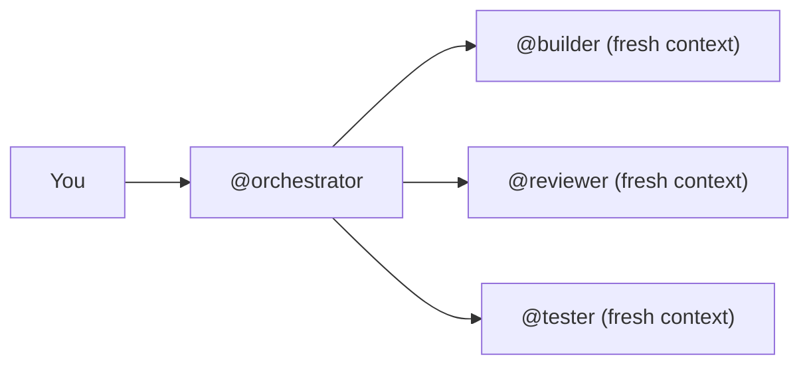

# Why Specialist Agent?

## The Problem with Generic AI Coding

### One-size-fits-all prompts fail at scale

Generic LLM prompts don't understand your architecture. They produce inconsistent code across modules, ignore existing patterns, and create technical debt faster than they save time.

A generic prompt doesn't know that your project uses a service layer pattern, or that your forms follow a specific validation strategy. It generates "working code" that doesn't fit your codebase.

### No verification means no trust

Most AI coding tools claim "done" without proof. No test output, no build verification, no architecture compliance check. You end up reviewing every line anyway, which defeats the purpose.

::: warning The "Should Work" Problem
If an AI tool says "the tests should pass" instead of actually running the tests, you can't trust its output. Every claim needs evidence.
:::

### Context pollution degrades quality

Long conversations accumulate stale context. Instructions from earlier messages get lost, naming conventions drift, and later outputs diverge from earlier decisions. By the 10th task, the AI has forgotten what it agreed to in the 1st.

## How Specialist Agent Solves This

### Specialized agents, not generic prompts

27+ agents, each with deep domain expertise:

| Need | Agent | Expertise |
|------|-------|-----------|
| Scaffold a module | `@builder` | Knows YOUR architecture patterns |
| Review a PR | `@reviewer` | 3-in-1: spec, quality, architecture |
| Fix a production bug | `@debugger` | Systematic 4-phase debugging |
| Design an API | `@api` | REST/GraphQL best practices |
| Add payments | `@finance` | Stripe, PCI compliance |
| Security audit | `@security` | OWASP Top 10, JWT, encryption |

Each agent has a focused mission, specific workflow, and clear output format. No "jack of all trades" - domain experts for every task.

### Proof-based verification

Every agent must show actual output before claiming completion:

```
✅ @builder: Created 6 files, all tests passing (14/14)
✅ @reviewer: Found 2 issues - both resolved
✅ @tdd: RED (3 failing) → GREEN (3 passing) → REFACTOR (3 passing)
```

Anti-rationalization tables prevent shortcuts. If an agent catches itself thinking "just this once" or "it's obvious" - it stops and follows the process.

### Context isolation by design

`@orchestrator` and `@executor` use fresh context per subagent. Each task gets a self-contained prompt - no accumulated context pollution:



### Architecture-aware from day one

Agents read your `ARCHITECTURE.md` and follow YOUR conventions:

- Your naming patterns, not generic ones
- Your folder structure, not a default template
- Your state management choice, not "whatever"
- Your testing strategy, not skipped tests

## Generic AI vs Specialist Agent

| Aspect | Generic AI | Specialist Agent |
|--------|-----------|-----------------|
| Architecture awareness | None | Reads ARCHITECTURE.md |
| Code verification | "Should work" | Actual test/build output |
| Cost control | Unpredictable | Adaptive planning + Lite mode |
| Agent specialization | One model does everything | 27+ domain experts |
| Governance | None | Anti-rationalization + verification |
| Framework support | Generic | 7 tailored packs |
| Context management | Degrades over time | Fresh context per task |
| Review quality | "LGTM" | Evidence-based verdicts |

## Lite Mode: Quality at a Fraction of the Cost

Every agent has a Lite variant that uses Haiku instead of Sonnet/Opus:

| Mode | Best For | Cost |
|------|----------|------|
| **Full** | Complex features, architecture decisions, PRs | Standard |
| **Lite** | Quick scaffolding, simple components, rapid iteration | **60-80% less** |

The `/estimate` skill tells you the expected cost before you start. No surprises.

::: tip When to use Lite Mode
Start with Lite for scaffolding and rapid prototyping. Switch to Full for complex business logic, security-critical code, and final reviews.
:::

## What's Next?

- [Quick Start](/guide/quick-start) - Get running in 2 minutes
- [Browse all agents](/reference/agents) - See what each agent does
- [Real-world scenarios](/scenarios/) - How teams use Specialist Agent daily
