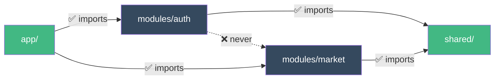
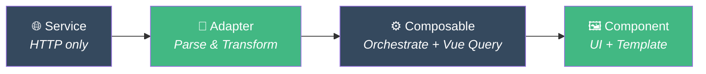
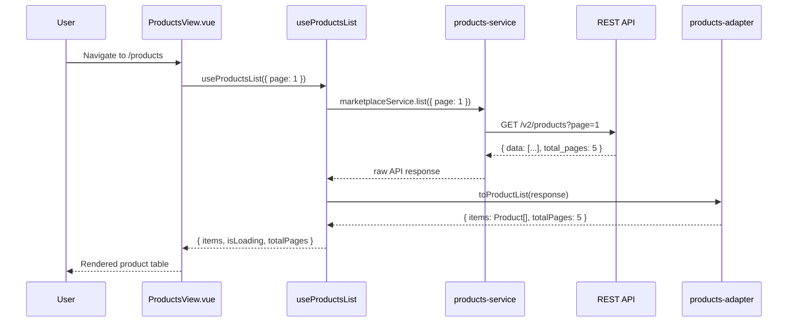

# Visao Geral da Arquitetura

::: info Nota sobre Framework
Os exemplos abaixo utilizam os padroes do **pack Vue 3**. Cada framework pack (React, Next.js, SvelteKit) fornece padroes equivalentes adaptados ao seu ecossistema. Veja [Framework Packs](/pt-BR/guide/introduction#como-os-packs-funcionam) para detalhes.
:::

O `docs/ARCHITECTURE.md` no seu projeto e a **fonte de verdade** que todos os agentes seguem. Esta pagina resume os padroes principais.

## Estrutura Modular

Cada funcionalidade e um modulo autocontido:

```text
src/modules/[feature]/
├── components/     ← UI
├── composables/    ← Logica (service → adapter → query)
├── services/       ← HTTP puro (sem try/catch)
├── adapters/       ← Parsers (API ↔ App)
├── stores/         ← Apenas estado do cliente (Pinia)
├── types/          ← .types.ts (API) + .contracts.ts (App)
├── views/          ← Paginas
├── __tests__/      ← Testes
└── index.ts        ← Barrel export (API publica)
```

## Regras de Importacao



- **Modules → Shared**: ✅ Permitido
- **Modules → Modules**: ❌ Nunca (mova o codigo compartilhado para `shared/`)
- **App → Modules**: ✅ Apenas router e registro

## Arquitetura de Quatro Camadas



| Camada | Faz | NAO Faz |
|--------|-----|---------|
| **Service** | Chamadas HTTP | try/catch, transformacao, logica |
| **Adapter** | Parsear API ↔ App (snake_case → camelCase) | HTTP, efeitos colaterais |
| **Composable** | Orquestrar service + adapter + Vue Query | Renderizar UI |
| **Pinia Store** | Estado do cliente (UI, filtros, preferencias) | Estado do servidor, HTTP |
| **Component** | UI + composicao | Logica de negocio pesada |

## Exemplo de Fluxo de Dados

Veja o que acontece quando um usuario visita a pagina de Produtos:



::: tip Separacao de Gerenciamento de Estado
**Pinia** = Estado do cliente (UI, filtros, preferencias)
**Vue Query** = Estado do servidor (dados da API, cache, atualizacao em segundo plano)
:::

## Convencoes de Nomenclatura

### Arquivos

| Tipo | Padrao | Exemplo |
|------|--------|---------|
| Diretorios | `kebab-case` | `user-settings/` |
| Componentes | `PascalCase.vue` | `UserSettingsForm.vue` |
| Views | `PascalCase + View.vue` | `MarketplaceView.vue` |
| Composables | `use + PascalCase.ts` | `useMarketplaceList.ts` |
| Services | `kebab-case-service.ts` | `marketplace-service.ts` |
| Adapters | `kebab-case-adapter.ts` | `marketplace-adapter.ts` |
| Stores | `kebab-case-store.ts` | `marketplace-store.ts` |
| Types | `kebab-case.types.ts` | `marketplace.types.ts` |
| Contracts | `kebab-case.contracts.ts` | `marketplace.contracts.ts` |

### Codigo

| Tipo | Padrao | Exemplo |
|------|--------|---------|
| Variaveis / funcoes | `camelCase` | `getUserById`, `isLoading` |
| Types / Interfaces | `PascalCase` | `UserProfile`, `MarketplaceItem` |
| Constantes | `UPPER_SNAKE_CASE` | `API_BASE_URL`, `MAX_RETRIES` |
| Composables | `use` + `PascalCase` | `useAuth`, `useMarketplaceList` |
| Booleanos | `is`/`has`/`can`/`should` | `isLoading`, `hasPermission` |
| Event handlers | `handle` + acao | `handleSubmit`, `handleDelete` |

## Padroes Principais

- **Pare o Prop Drilling**: Use slots + provide/inject + composables diretos
- **Utils vs Helpers**: Utils = funcoes puras, Helpers = funcoes com efeitos colaterais
- **Tratamento de Erros**: Centralizado nos composables (Vue Query `onError`)
- **SOLID no Vue**: Cada arquivo = 1 responsabilidade

## Mergulho Profundo

- [Camadas](/pt-BR/guide/layers) - Exemplos detalhados de cada camada
- [Componentes](/pt-BR/guide/components) - Padroes e composicao de componentes
- Referencia completa: `docs/ARCHITECTURE.md` no seu projeto
