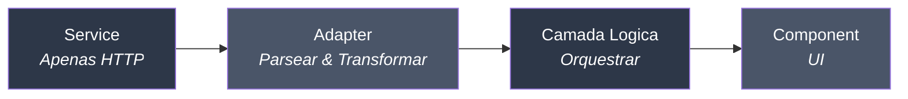
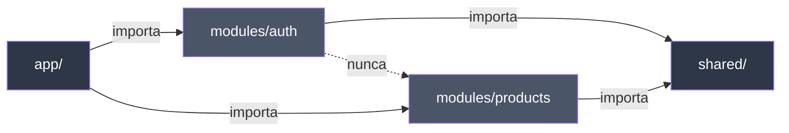

# Visao Geral da Arquitetura

O arquivo `docs/ARCHITECTURE.md` e uma configuracao **opcional** que personaliza como os agentes geram e revisam codigo no seu projeto. Quando presente, todos os agentes seguem seus padroes. Quando ausente, os agentes usam boas praticas genericas para o seu framework.

::: tip Opcional
Durante `specialist-agent init`, voce escolhe se deseja instalar o guia de arquitetura. Voce pode adiciona-lo depois copiando do pack do seu framework para `docs/ARCHITECTURE.md`.
:::

## Como Funciona

1. Durante o `init`, escolha instalar `docs/ARCHITECTURE.md` (ou pule)
2. Os agentes verificam se o arquivo existe antes de cada acao
3. Se encontrado, seguem seus padroes para geracao e revisao de codigo
4. Se nao encontrado, usam boas praticas genericas
5. Edite o arquivo a qualquer momento para mudar o comportamento dos agentes — sem reiniciar

## Padrao Universal

Todos os framework packs seguem a mesma arquitetura de quatro camadas:



| Camada | Faz | NAO Faz |
|--------|-----|---------|
| **Service** | Chamadas HTTP | try/catch, transformacao, logica |
| **Adapter** | Parsear API ↔ App (snake_case → camelCase) | HTTP, efeitos colaterais |
| **Logica** | Orquestrar service + adapter + estado | Renderizar UI |
| **State Store** | Estado do cliente (UI, filtros, preferencias) | Estado do servidor, HTTP |
| **Component** | UI + composicao | Logica de negocio pesada |

### Equivalentes por Framework

Cada framework tem sua propria terminologia para os mesmos conceitos:

| Camada | Vue | React | Next.js | SvelteKit | Angular | Astro | Nuxt |
|--------|-----|-------|---------|-----------|---------|-------|------|
| **Logica** | Composable | Hook | Hook / Server Action | Load function | Service + inject() | Endpoint | Composable / useFetch |
| **Estado cliente** | Pinia | Zustand | Zustand | Svelte stores | Signals | — | Pinia / useState |
| **Estado servidor** | TanStack Vue Query | TanStack React Query | TanStack + RSC | SvelteKit load | HttpClient | — | useFetch / useAsyncData |
| **Componente** | SFC (.vue) | JSX (.tsx) | JSX (.tsx) | .svelte | Standalone component | .astro / Islands | SFC (.vue) |

## Estrutura Modular

Cada funcionalidade e um modulo autocontido:

```text
src/modules/[feature]/
├── components/     ← UI
├── logic/          ← Orquestracao (hooks, composables, load functions)
├── services/       ← HTTP puro (sem try/catch)
├── adapters/       ← Parsers (API ↔ App)
├── stores/         ← Apenas estado do cliente
├── types/          ← .types.ts (API) + .contracts.ts (App)
├── views/          ← Paginas
├── __tests__/      ← Testes
└── index.ts        ← Barrel export (API publica)
```

## Regras de Importacao



- **Modules → Shared**: Permitido
- **Modules → Modules**: Nunca (mova o codigo compartilhado para `shared/`)
- **App → Modules**: Apenas router e registro

## Convencoes de Nomenclatura

### Arquivos

| Tipo | Padrao | Exemplo |
|------|--------|---------|
| Diretorios | `kebab-case` | `user-settings/` |
| Componentes | `PascalCase` | `UserSettingsForm` |
| Views / Paginas | `PascalCase` | `MarketplaceView` |
| Logica (hooks, etc.) | `use` + `PascalCase.ts` | `useProductsList.ts` |
| Services | `kebab-case-service.ts` | `products-service.ts` |
| Adapters | `kebab-case-adapter.ts` | `products-adapter.ts` |
| Types | `kebab-case.types.ts` | `products.types.ts` |
| Contracts | `kebab-case.contracts.ts` | `products.contracts.ts` |

### Codigo

| Tipo | Padrao | Exemplo |
|------|--------|---------|
| Variaveis / funcoes | `camelCase` | `getUserById`, `isLoading` |
| Types / Interfaces | `PascalCase` | `UserProfile`, `Product` |
| Constantes | `UPPER_SNAKE_CASE` | `API_BASE_URL`, `MAX_RETRIES` |
| Booleanos | `is`/`has`/`can`/`should` | `isLoading`, `hasPermission` |
| Event handlers | `handle` + acao | `handleSubmit`, `handleDelete` |

## Padroes Principais

- **Evite Prop Drilling**: Use padroes de composicao nativos do seu framework
- **Utils vs Helpers**: Utils = funcoes puras, Helpers = funcoes com efeitos colaterais
- **Tratamento de Erros**: Centralizado na camada de logica
- **SOLID**: Cada arquivo = 1 responsabilidade

## Sem ARCHITECTURE.md

Quando nao ha `docs/ARCHITECTURE.md` no projeto:

- **Agentes funcionam normalmente** — usam padroes genericos para o seu framework
- **@planner** nota a ausencia e usa padroes genericos
- **@builder** gera codigo usando convencoes padroes do framework
- **@reviewer** revisa contra boas praticas gerais

Para adicionar depois:

```bash
# Copie do pack do seu framework instalado
cp node_modules/specialist-agent/packs/{framework}/ARCHITECTURE.md docs/ARCHITECTURE.md
```

## Mergulho Profundo

- [Camadas](/pt-BR/guide/layers) — Exemplos detalhados de cada camada
- [Componentes](/pt-BR/guide/components) — Padroes e composicao de componentes
- Referencia completa: `docs/ARCHITECTURE.md` no seu projeto (se instalado)
