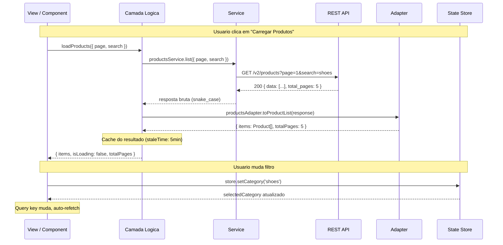
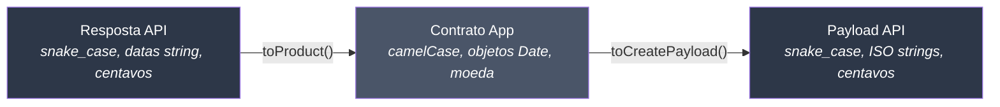
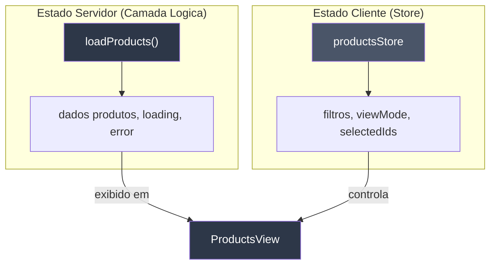

# Camadas de Responsabilidade

Cada camada na arquitetura tem uma responsabilidade unica e bem definida. Todos os framework packs seguem o mesmo padrao de camadas — apenas os detalhes de implementacao diferem.

## Fluxo Completo de Requisicao



### Camada Logica por Framework

| Framework | Camada logica | Cache / Estado servidor |
|-----------|---------------|-------------------------|
| Vue | Composable (`useXxx`) | TanStack Vue Query |
| React | Hook (`useXxx`) | TanStack React Query |
| Next.js | Hook / Server Action | TanStack + RSC |
| SvelteKit | Load function | Built-in SvelteKit |
| Angular | Service + `inject()` | HttpClient |
| Nuxt | Composable / `useFetch` | Built-in Nuxt |

## Service — HTTP Puro

Services fazem a requisicao HTTP. Nada mais.

```typescript
// services/products-service.ts
import { api } from '@/shared/services/api-client'
import type {
  ProductListResponse,
  ProductItemResponse,
  CreateProductPayload,
} from '../types/products.types'

export const productsService = {
  list(params: { page: number; pageSize: number; search?: string }) {
    return api.get<ProductListResponse>('/v2/products', { params })
  },

  getById(id: string) {
    return api.get<ProductItemResponse>(`/v2/products/${id}`)
  },

  create(payload: CreateProductPayload) {
    return api.post<ProductItemResponse>('/v2/products', payload)
  },

  update(id: string, payload: Partial<CreateProductPayload>) {
    return api.patch<ProductItemResponse>(`/v2/products/${id}`, payload)
  },

  delete(id: string) {
    return api.delete(`/v2/products/${id}`)
  },
}
```

**Regras:**

- Chamadas HTTP com request/response tipados
- Um arquivo por dominio/recurso
- Exportar como objeto com metodos
- Sem try/catch (o chamador trata os erros)
- Sem transformacao de dados (o adapter faz isso)
- Sem logica de negocio
- Sem acesso a store ou camada logica

::: warning Erro comum
Nao adicione `try/catch` nos services. O tratamento de erros pertence a camada logica (hooks, composables, load functions, etc.).
:::

## Adapter — Parsers de Contrato

Adapters transformam dados entre o formato da API e o formato do app. Sao **funcoes puras** sem efeitos colaterais.



```typescript
// adapters/products-adapter.ts
import type { ProductItemResponse } from '../types/products.types'
import type { Product } from '../types/products.contracts'

export const productsAdapter = {
  // Entrada: API → App
  toProduct(response: ProductItemResponse): Product {
    return {
      id: response.uuid,
      name: response.name,
      description: response.description,
      vendor: response.vendor_name,
      category: response.category_slug,
      price: response.price_cents / 100,
      isActive: response.status === 'active',
      imageUrl: response.image_url,
      createdAt: new Date(response.created_at),
      updatedAt: new Date(response.updated_at),
    }
  },

  // Saida: App → API
  toCreatePayload(input: CreateProductInput): CreateProductPayload {
    return {
      name: input.name,
      description: input.description,
      vendor_name: input.vendor,
      category_slug: input.category,
      price_cents: Math.round(input.price * 100),
      image_url: input.imageUrl,
    }
  },
}
```

**Regras:**

- Funcoes puras (entrada → saida)
- Bidirecional: API → App (entrada) e App → API (saida)
- Renomear campos (snake_case → camelCase)
- Converter tipos (string → Date, centavos → decimal, status → booleano)
- Sem chamadas HTTP
- Sem acesso a store ou camada logica

## Types e Contracts

Dois arquivos separados para o mesmo recurso:

```typescript
// types/products.types.ts — Resposta exata da API (snake_case)
export interface ProductItemResponse {
  uuid: string
  name: string
  description: string
  vendor_name: string
  category_slug: string
  price_cents: number
  status: 'active' | 'inactive' | 'pending'
  image_url: string | null
  created_at: string       // ISO 8601
  updated_at: string       // ISO 8601
}

export interface ProductListResponse {
  data: ProductItemResponse[]
  total_pages: number
  current_page: number
}
```

```typescript
// types/products.contracts.ts — Contrato do app (camelCase)
export interface Product {
  id: string
  name: string
  description: string
  vendor: string
  category: string
  price: number            // em moeda, nao centavos
  isActive: boolean        // derivado do status
  imageUrl: string | null
  createdAt: Date          // Objeto Date, nao string
  updatedAt: Date
}
```

::: tip Por que dois arquivos?
- `.types.ts` espelha a API exatamente — se a API mudar, apenas este arquivo muda
- `.contracts.ts` e o que seus componentes realmente usam — interface estavel do app
- O adapter faz a ponte entre eles
:::

## Camada Logica — Orquestracao

A camada logica conecta tudo: chama o service, passa pelo adapter, gerencia loading/error, e expoe dados para a UI.

Cada framework implementa de forma diferente:

| Framework | Padrao | Exemplo |
|-----------|--------|---------|
| Vue | Composable + Vue Query | `useProductsList()` |
| React | Hook + React Query | `useProductsList()` |
| Next.js | Hook + Server Action | `useProductsList()` / `createProduct()` |
| SvelteKit | Load function | `+page.ts load()` |
| Angular | Service + inject() | `ProductsService` |
| Nuxt | Composable + useFetch | `useProductsList()` |

**Regras (universais):**

- Orquestrar: service → adapter → dados reativos
- Gerenciar estados de loading, error e vazio
- Retornar valores reativos/observaveis (nunca brutos)
- Sem template/renderizacao
- Sem acesso direto a API (o service faz isso)

## Client State Store

Estado do cliente e para dados que **nao vem do servidor**: preferencias de UI, filtros, selecoes.



| Framework | Estado cliente | Estado servidor |
|-----------|---------------|-----------------|
| Vue | Pinia | TanStack Vue Query |
| React | Zustand | TanStack React Query |
| Next.js | Zustand | TanStack + Server Components |
| SvelteKit | Svelte stores | SvelteKit load |
| Angular | Signals | HttpClient |
| Nuxt | Pinia / useState | useFetch / useAsyncData |

**Regras (universais):**

- Apenas estado do cliente (UI, filtros, preferencias, sessao)
- Sem estado do servidor (dados da API pertencem a camada logica)
- Sem chamadas HTTP
