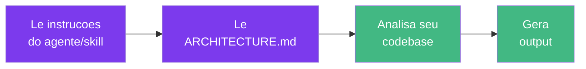

# Uso de Tokens

Cada operacao tem um custo diferente de tokens dependendo da complexidade. Use esta tabela para estimar o uso.

## Como os Tokens Sao Consumidos

Toda vez que voce invoca um agente ou skill, o Claude Code executa multiplas etapas - cada uma consumindo tokens:

| Etapa | O que acontece | Impacto em tokens |
|-------|---------------|-------------------|
| **1. Le instrucoes** | Claude carrega o markdown do agente/skill | Fixo (~1-2k) |
| **2. Le ARCHITECTURE.md** | Claude carrega os padroes de arquitetura | Fixo (~2-4k) |
| **3. Analisa codebase** | Claude le arquivos existentes para contexto | Variavel (depende do escopo) |
| **4. Gera output** | Claude escreve codigo, revisoes ou relatorios | Variavel (depende da complexidade) |

::: info
As contagens de tokens abaixo sao **totais por operacao** (todas as 4 etapas combinadas). Os custos reais dependem do preco por token do modelo - consulte a [pagina de precos da Anthropic](https://www.anthropic.com/pricing) para taxas atuais.
:::

## Agentes Full (Sonnet/Opus)

| Operacao | Tokens | Observacoes |
|----------|--------|-------------|
| `/dev-create-component` | ~3-5k | Componente unico |
| `/dev-create-service` | ~5-8k | 4 arquivos (types + contracts + adapter + service) |
| `/dev-create-composable` | ~3-5k | Composable unico |
| `/dev-create-test` | ~3-8k | Depende da complexidade do arquivo |
| `/dev-create-module` | ~15-25k | Scaffold completo de modulo |
| `/dev-generate-types` | ~3-5k | Types + contracts + adapter |
| `/review-check-architecture` | ~5-10k | Verificacoes automatizadas |
| `/review-review` | ~8-15k | Revisao completa com automatizada + manual |
| `/review-fix-violations` | ~5-15k | Depende da quantidade de violacoes |
| `/docs-onboard` | ~3-5k | Resumo do modulo |
| `/migration-migrate-component` | ~5-10k | Migracao de componente unico |
| `/migration-migrate-module` | ~30-80k | Migracao completa de modulo (6 fases) |
| `@doctor` (bug) | ~5-15k | Depende da complexidade do bug |
| `@explorer` (assessment) | ~10-20k | Depende do tamanho do codebase |
| `@starter` (novo projeto) | ~15-30k | Depende da complexidade da stack |

## Agentes Lite (Haiku)

Agentes Lite usam `model: haiku` - significativamente mais baratos por token.

| Operacao | Tokens | Economia vs Full |
|----------|--------|-----------------|
| Scaffold de componente | ~2-3k | ~50% |
| Camada de servico | ~3-5k | ~40% |
| Revisao de codigo | ~3-5k | ~55% |
| Scaffold de modulo | ~5-10k | ~55% |
| Investigacao de bug | ~2-5k | ~50% |

## Cenarios do Mundo Real

### Cenario 1: Construir um modulo CRUD completo

Um modulo tipico de "Pedidos" para e-commerce do zero:

| Etapa | Agente/Skill | Tokens |
|-------|-------------|--------|
| Scaffold do modulo | `/dev-create-module orders` | ~20k |
| Adicionar validacao de formulario | `@builder` (composable + componente) | ~8k |
| Escrever testes unitarios | `/dev-create-test` (3 arquivos) | ~15k |
| Revisar antes do PR | `/review-review orders` | ~12k |
| **Total** | | **~55k** |

### Cenario 2: Revisao de sprint (5 PRs)

Sessao de revisao no fim da sprint:

| Etapa | Agente/Skill | Tokens |
|-------|-------------|--------|
| Verificacao de arquitetura | `/review-check-architecture` (5x) | ~35k |
| Revisao completa (2 PRs complexos) | `/review-review` (2x) | ~25k |
| Corrigir violacoes encontradas | `/review-fix-violations` (1x) | ~10k |
| **Total** | | **~70k** |

### Cenario 3: Migrar um modulo legado

Convertendo um modulo Vuex + Options API para a arquitetura alvo:

| Etapa | Agente/Skill | Tokens |
|-------|-------------|--------|
| Avaliar codebase primeiro | `@explorer` | ~15k |
| Migracao completa do modulo | `/migration-migrate-module` | ~60k |
| Revisao pos-migracao | `/review-review` | ~12k |
| Corrigir problemas restantes | `@doctor` | ~8k |
| **Total** | | **~95k** |

## Quando Usar Lite vs Full

| Situacao | Recomendacao | Por que |
|----------|-------------|---------|
| Prototipagem rapida | **Lite** | Velocidade importa mais que polimento |
| Scaffold de componente simples | **Lite** | Baixa complexidade, Haiku resolve bem |
| Verificacao rapida de arquitetura | **Lite** | Checks automatizados nao precisam de raciocinio profundo |
| Novo modulo do zero | **Full** | Decisoes complexas precisam de modelo mais forte |
| Revisao de PR antes do merge | **Full** | Captura problemas sutis que Haiku pode perder |
| Migracao completa de modulo | **Full** | Processo de 6 fases requer entendimento profundo |
| Investigacao de bug | **Full** | Rastrear camadas precisa de raciocinio forte |
| Iterando em um componente | **Lite primeiro**, depois Full | Rascunhe com Lite, polir com Full |

## Dicas para Reduzir Uso de Tokens

1. **Escopo pequeno** - `/dev-create-component ProductCard` custa ~4k vs `/dev-create-module products` a ~20k. Scaffold apenas o que voce precisa.

2. **Migre incrementalmente** - Use `/migration-migrate-component` (~8k por arquivo) em vez de `/migration-migrate-module` (~60k) quando possivel.

3. **Use Lite para iteracao** - Rascunhe com agentes Lite, depois rode uma unica revisao Full no final.

4. **Prefira skills a agentes** - Skills como `/dev-create-service` sao mais focadas e baratas do que pedir a mesma coisa ao `@builder`.

5. **Agrupe revisoes** - Rode `/review-check-architecture` (automatizado, ~7k) antes de `/review-review` (completo, ~12k). Se o automatizado passar, voce pode nao precisar da revisao completa.

::: tip Resumo de Otimizacao de Custos
- Use **agentes Lite** para iteracao rapida e tarefas simples
- Use **agentes Full** para novos modulos, PRs e migracoes complexas
- Para modulos grandes, migre incrementalmente - um componente por vez com `/migration-migrate-component` em vez da migracao completa do modulo
:::
