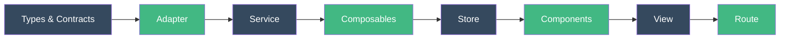
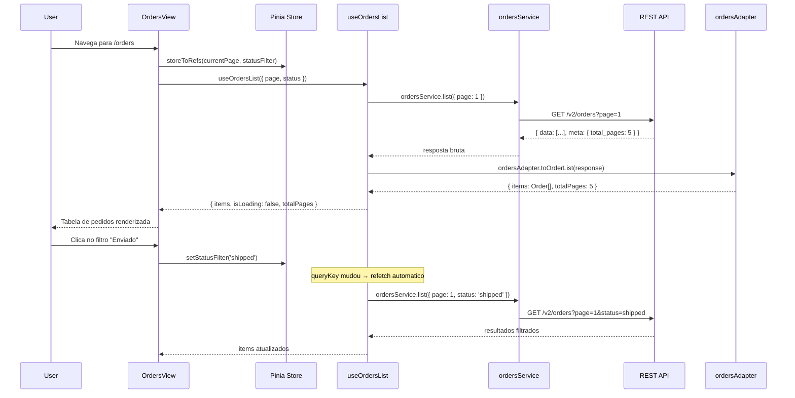

# Como Construir um Modulo CRUD

::: info Nota sobre Framework
Os exemplos abaixo utilizam os padroes do **pack Vue 3**. Cada framework pack (React, Next.js, SvelteKit) fornece padroes equivalentes adaptados ao seu ecossistema. Veja [Framework Packs](/pt-BR/guide/introduction#como-os-packs-funcionam) para detalhes.
:::

Este tutorial guia voce na construcao de um modulo completo de **Pedidos** para um app de e-commerce - do zero ate uma funcionalidade totalmente funcional com listagem, criacao, edicao e exclusao.

## O Que Voce Vai Construir



## Passo 1 - Criar a Estrutura do Modulo

```bash
mkdir -p src/modules/orders/{types,adapters,services,composables,stores,components,views,__tests__}
touch src/modules/orders/index.ts
```

```text
src/modules/orders/
├── types/
├── adapters/
├── services/
├── composables/
├── stores/
├── components/
├── views/
├── __tests__/
└── index.ts
```

## Passo 2 - Definir os Types (Resposta da API)

Este e o **formato exato** que a API retorna. Mantenha-o identico ao JSON.

```typescript
// src/modules/orders/types/orders.types.ts

export interface OrderItemResponse {
  id: number
  order_number: string
  customer_name: string
  customer_email: string
  status: 'pending' | 'confirmed' | 'shipped' | 'delivered' | 'cancelled'
  total_cents: number
  currency: string
  items_count: number
  shipping_address: {
    street: string
    city: string
    state: string
    zip_code: string
    country: string
  }
  notes: string | null
  created_at: string   // ISO 8601
  updated_at: string   // ISO 8601
}

export interface OrderListResponse {
  data: OrderItemResponse[]
  meta: {
    current_page: number
    total_pages: number
    total_count: number
    per_page: number
  }
}

export interface CreateOrderPayload {
  customer_name: string
  customer_email: string
  items: Array<{ product_id: number; quantity: number }>
  shipping_address: {
    street: string
    city: string
    state: string
    zip_code: string
    country: string
  }
  notes?: string
}
```

::: tip Por que snake_case?
O arquivo de types espelha a API exatamente. A maioria das APIs REST usa `snake_case`. O codigo da sua aplicacao usara `camelCase` - o adapter cuida da conversao.
:::

## Passo 3 - Definir os Contracts (Interface da Aplicacao)

Isto e o que seus **componentes realmente usam**. Limpo, tipado, camelCase.

```typescript
// src/modules/orders/types/orders.contracts.ts

export interface Order {
  id: number
  orderNumber: string
  customerName: string
  customerEmail: string
  status: OrderStatus
  total: number              // em moeda, nao em centavos
  currency: string
  itemsCount: number
  shippingAddress: Address
  notes: string | null
  createdAt: Date
  updatedAt: Date
}

export type OrderStatus = 'pending' | 'confirmed' | 'shipped' | 'delivered' | 'cancelled'

export interface Address {
  street: string
  city: string
  state: string
  zipCode: string
  country: string
}

export interface CreateOrderInput {
  customerName: string
  customerEmail: string
  items: Array<{ productId: number; quantity: number }>
  shippingAddress: Address
  notes?: string
}

export interface OrderListResult {
  items: Order[]
  currentPage: number
  totalPages: number
  totalCount: number
}
```

## Passo 4 - Construir o Adapter

O adapter e uma **funcao pura** - sem HTTP, sem efeitos colaterais. Ele converte entre os dois formatos.

```typescript
// src/modules/orders/adapters/orders-adapter.ts

import type { OrderItemResponse, OrderListResponse, CreateOrderPayload } from '../types/orders.types'
import type { Order, OrderListResult, CreateOrderInput } from '../types/orders.contracts'

export const ordersAdapter = {
  /** API → App */
  toOrder(response: OrderItemResponse): Order {
    return {
      id: response.id,
      orderNumber: response.order_number,
      customerName: response.customer_name,
      customerEmail: response.customer_email,
      status: response.status,
      total: response.total_cents / 100,
      currency: response.currency,
      itemsCount: response.items_count,
      shippingAddress: {
        street: response.shipping_address.street,
        city: response.shipping_address.city,
        state: response.shipping_address.state,
        zipCode: response.shipping_address.zip_code,
        country: response.shipping_address.country,
      },
      notes: response.notes,
      createdAt: new Date(response.created_at),
      updatedAt: new Date(response.updated_at),
    }
  },

  /** Lista da API → Lista da App */
  toOrderList(response: OrderListResponse): OrderListResult {
    return {
      items: response.data.map(ordersAdapter.toOrder),
      currentPage: response.meta.current_page,
      totalPages: response.meta.total_pages,
      totalCount: response.meta.total_count,
    }
  },

  /** App → API (para criacao) */
  toCreatePayload(input: CreateOrderInput): CreateOrderPayload {
    return {
      customer_name: input.customerName,
      customer_email: input.customerEmail,
      items: input.items.map(item => ({
        product_id: item.productId,
        quantity: item.quantity,
      })),
      shipping_address: {
        street: input.shippingAddress.street,
        city: input.shippingAddress.city,
        state: input.shippingAddress.state,
        zip_code: input.shippingAddress.zipCode,
        country: input.shippingAddress.country,
      },
      notes: input.notes,
    }
  },
}
```

::: warning Bidirecional
Sempre crie ambas as direcoes: **entrada** (API → App) para leituras e **saida** (App → API) para escritas. Isso mantem o adapter como o unico ponto de conversao.
:::

## Passo 5 - Construir o Service

O service faz chamadas HTTP. **Nada mais.** Sem try/catch, sem transformacao.

```typescript
// src/modules/orders/services/orders-service.ts

import { api } from '@/shared/services/api-client'
import type { OrderItemResponse, OrderListResponse, CreateOrderPayload } from '../types/orders.types'

export const ordersService = {
  list(params: { page: number; perPage?: number; status?: string }) {
    return api.get<OrderListResponse>('/v2/orders', { params })
  },

  getById(id: number) {
    return api.get<OrderItemResponse>(`/v2/orders/${id}`)
  },

  create(payload: CreateOrderPayload) {
    return api.post<OrderItemResponse>('/v2/orders', payload)
  },

  update(id: number, payload: Partial<CreateOrderPayload>) {
    return api.patch<OrderItemResponse>(`/v2/orders/${id}`, payload)
  },

  cancel(id: number) {
    return api.post<OrderItemResponse>(`/v2/orders/${id}/cancel`)
  },
}
```

## Passo 6 - Construir os Composables

### Composable de listagem (query)

```typescript
// src/modules/orders/composables/useOrdersList.ts

import { computed, type MaybeRef, toValue } from 'vue'
import { useQuery, keepPreviousData } from '@tanstack/vue-query'
import { ordersService } from '../services/orders-service'
import { ordersAdapter } from '../adapters/orders-adapter'

export function useOrdersList(options: {
  page: MaybeRef<number>
  perPage?: MaybeRef<number>
  status?: MaybeRef<string | undefined>
}) {
  const page = computed(() => toValue(options.page))
  const perPage = computed(() => toValue(options.perPage) ?? 20)
  const status = computed(() => toValue(options.status))

  const { data, isLoading, isFetching, error, refetch } = useQuery({
    queryKey: computed(() => ['orders', 'list', {
      page: page.value,
      perPage: perPage.value,
      status: status.value,
    }]),
    queryFn: async () => {
      const response = await ordersService.list({
        page: page.value,
        perPage: perPage.value,
        status: status.value,
      })
      return ordersAdapter.toOrderList(response.data)
    },
    staleTime: 2 * 60 * 1000,        // 2 minutos
    placeholderData: keepPreviousData, // paginacao suave
  })

  const items = computed(() => data.value?.items ?? [])
  const totalPages = computed(() => data.value?.totalPages ?? 0)
  const totalCount = computed(() => data.value?.totalCount ?? 0)
  const isEmpty = computed(() => !isLoading.value && items.value.length === 0)

  return {
    items, totalPages, totalCount, isEmpty,
    isLoading, isFetching, error, refetch,
  }
}
```

### Composable de criacao (mutation)

```typescript
// src/modules/orders/composables/useCreateOrder.ts

import { useMutation, useQueryClient } from '@tanstack/vue-query'
import { ordersService } from '../services/orders-service'
import { ordersAdapter } from '../adapters/orders-adapter'
import type { CreateOrderInput } from '../types/orders.contracts'

export function useCreateOrder() {
  const queryClient = useQueryClient()

  const { mutate, isPending, error, isSuccess } = useMutation({
    mutationFn: (input: CreateOrderInput) => {
      const payload = ordersAdapter.toCreatePayload(input)
      return ordersService.create(payload)
    },
    onSuccess: () => {
      // Invalida a lista para que ela busque novamente com o novo pedido
      queryClient.invalidateQueries({ queryKey: ['orders'] })
    },
  })

  return { createOrder: mutate, isPending, error, isSuccess }
}
```

### Composable de cancelamento (mutation)

```typescript
// src/modules/orders/composables/useCancelOrder.ts

import { useMutation, useQueryClient } from '@tanstack/vue-query'
import { ordersService } from '../services/orders-service'

export function useCancelOrder() {
  const queryClient = useQueryClient()

  const { mutate, isPending } = useMutation({
    mutationFn: (orderId: number) => ordersService.cancel(orderId),
    onSuccess: () => {
      queryClient.invalidateQueries({ queryKey: ['orders'] })
    },
  })

  return { cancelOrder: mutate, isCancelling: isPending }
}
```

## Passo 7 - Construir a Store (Estado do Cliente)

A store armazena **apenas estado da UI** - nao dados do servidor.

```typescript
// src/modules/orders/stores/orders-store.ts

import { defineStore } from 'pinia'
import { ref, computed, readonly } from 'vue'
import type { OrderStatus } from '../types/orders.contracts'

export const useOrdersStore = defineStore('orders', () => {
  const currentPage = ref(1)
  const statusFilter = ref<OrderStatus | undefined>(undefined)
  const selectedOrderIds = ref<Set<number>>(new Set())

  const hasActiveFilters = computed(() => !!statusFilter.value)
  const selectedCount = computed(() => selectedOrderIds.value.size)

  function setPage(page: number) {
    currentPage.value = page
  }

  function setStatusFilter(status: OrderStatus | undefined) {
    statusFilter.value = status
    currentPage.value = 1  // volta para a pagina 1 quando o filtro muda
  }

  function toggleSelection(id: number) {
    if (selectedOrderIds.value.has(id)) {
      selectedOrderIds.value.delete(id)
    } else {
      selectedOrderIds.value.add(id)
    }
  }

  function clearSelection() {
    selectedOrderIds.value.clear()
  }

  return {
    currentPage: readonly(currentPage),
    statusFilter: readonly(statusFilter),
    selectedOrderIds: readonly(selectedOrderIds),
    hasActiveFilters,
    selectedCount,
    setPage,
    setStatusFilter,
    toggleSelection,
    clearSelection,
  }
})
```

## Passo 8 - Construir os Componentes

### OrdersTable.vue

```vue
<!-- src/modules/orders/components/OrdersTable.vue -->
<script setup lang="ts">
import type { Order } from '../types/orders.contracts'

const props = defineProps<{
  orders: Order[]
  loading?: boolean
}>()

const emit = defineEmits<{
  select: [order: Order]
  cancel: [orderId: number]
}>()

function formatCurrency(value: number, currency: string) {
  return new Intl.NumberFormat('en-US', { style: 'currency', currency }).format(value)
}

function formatDate(date: Date) {
  return new Intl.DateTimeFormat('en-US', { dateStyle: 'medium' }).format(date)
}
</script>

<template>
  <div v-if="loading" class="loading">Carregando pedidos...</div>

  <table v-else-if="orders.length > 0">
    <thead>
      <tr>
        <th>Pedido</th>
        <th>Cliente</th>
        <th>Status</th>
        <th>Total</th>
        <th>Data</th>
        <th>Acoes</th>
      </tr>
    </thead>
    <tbody>
      <tr v-for="order in orders" :key="order.id">
        <td>{{ order.orderNumber }}</td>
        <td>{{ order.customerName }}</td>
        <td>
          <span :class="['badge', `badge--${order.status}`]">
            {{ order.status }}
          </span>
        </td>
        <td>{{ formatCurrency(order.total, order.currency) }}</td>
        <td>{{ formatDate(order.createdAt) }}</td>
        <td>
          <button @click="emit('select', order)">Ver</button>
          <button
            v-if="order.status === 'pending'"
            @click="emit('cancel', order.id)"
          >
            Cancelar
          </button>
        </td>
      </tr>
    </tbody>
  </table>

  <div v-else class="empty">Nenhum pedido encontrado.</div>
</template>
```

### OrderStatusFilter.vue

```vue
<!-- src/modules/orders/components/OrderStatusFilter.vue -->
<script setup lang="ts">
import type { OrderStatus } from '../types/orders.contracts'

defineProps<{
  currentStatus?: OrderStatus
}>()

const emit = defineEmits<{
  change: [status: OrderStatus | undefined]
}>()

const statuses: Array<{ value: OrderStatus; label: string }> = [
  { value: 'pending', label: 'Pendente' },
  { value: 'confirmed', label: 'Confirmado' },
  { value: 'shipped', label: 'Enviado' },
  { value: 'delivered', label: 'Entregue' },
  { value: 'cancelled', label: 'Cancelado' },
]
</script>

<template>
  <div class="filter-bar">
    <button
      :class="{ active: !currentStatus }"
      @click="emit('change', undefined)"
    >
      Todos
    </button>
    <button
      v-for="s in statuses"
      :key="s.value"
      :class="{ active: currentStatus === s.value }"
      @click="emit('change', s.value)"
    >
      {{ s.label }}
    </button>
  </div>
</template>
```

## Passo 9 - Construir a View

A view **compoe** componentes e os conecta aos composables e stores.

```vue
<!-- src/modules/orders/views/OrdersView.vue -->
<script setup lang="ts">
import { storeToRefs } from 'pinia'
import { useOrdersStore } from '../stores/orders-store'
import { useOrdersList } from '../composables/useOrdersList'
import { useCancelOrder } from '../composables/useCancelOrder'
import OrdersTable from '../components/OrdersTable.vue'
import OrderStatusFilter from '../components/OrderStatusFilter.vue'

const store = useOrdersStore()
const { currentPage, statusFilter } = storeToRefs(store)

const { items, totalPages, isLoading, isEmpty } = useOrdersList({
  page: currentPage,
  status: statusFilter,
})

const { cancelOrder, isCancelling } = useCancelOrder()
</script>

<template>
  <div class="orders-view">
    <h1>Pedidos</h1>

    <OrderStatusFilter
      :current-status="statusFilter"
      @change="store.setStatusFilter"
    />

    <OrdersTable
      :orders="items"
      :loading="isLoading || isCancelling"
      @cancel="cancelOrder"
    />

    <div v-if="totalPages > 1" class="pagination">
      <button :disabled="currentPage <= 1" @click="store.setPage(currentPage - 1)">
        Anterior
      </button>
      <span>Pagina {{ currentPage }} de {{ totalPages }}</span>
      <button :disabled="currentPage >= totalPages" @click="store.setPage(currentPage + 1)">
        Proximo
      </button>
    </div>
  </div>
</template>
```

## Passo 10 - Registrar a Rota

```typescript
// src/router/index.ts (adicione ao array de rotas)
{
  path: '/orders',
  name: 'orders',
  component: () => import('@/modules/orders/views/OrdersView.vue'),
  meta: { title: 'Pedidos' },
}
```

::: tip Lazy loading
Sempre use `() => import(...)` para componentes de rota. Isso cria chunks separados e reduz o tamanho do bundle inicial.
:::

## Passo 11 - Criar o Barrel Export

```typescript
// src/modules/orders/index.ts

// API publica - exporte apenas o que outras partes da app precisam
export type { Order, OrderStatus, Address } from './types/orders.contracts'
export { useOrdersList } from './composables/useOrdersList'
export { useCreateOrder } from './composables/useCreateOrder'
```

## Fluxo de Dados Completo



## Usando o Agente

Voce pode construir tudo isso automaticamente:

```bash
"Use @builder to create an orders module with CRUD for GET/POST/PATCH /v2/orders"
```

O agente segue os mesmos passos deste tutorial, lendo as convencoes do seu `ARCHITECTURE.md`.

## Proximos Passos

- [Tutorial da Camada de Service](/pt-BR/tutorials/service-layer) - Mergulho profundo em types + adapter + service
- [Tutorial de Formularios](/pt-BR/tutorials/forms) - Construa um formulario de criacao com validacao Zod
- [Paginacao + Filtros](/pt-BR/tutorials/pagination-filters) - Padroes avancados de listagem
