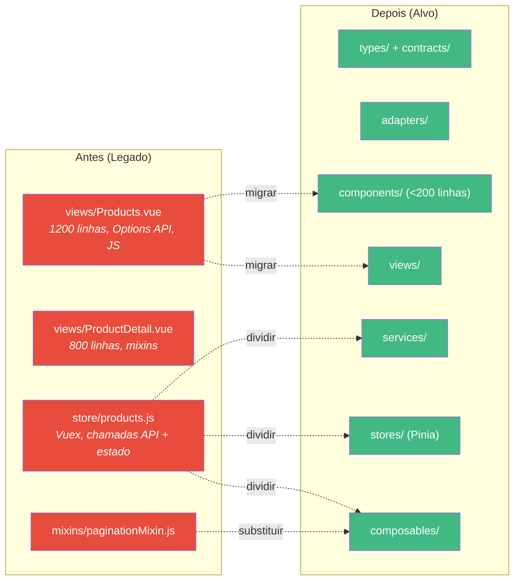
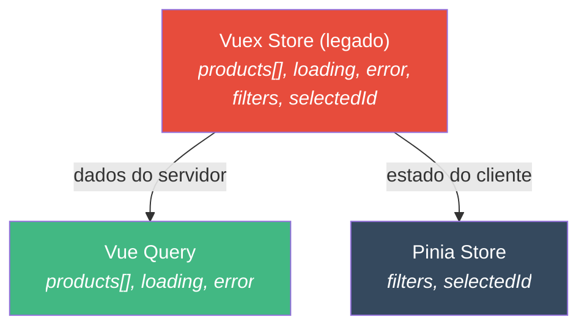
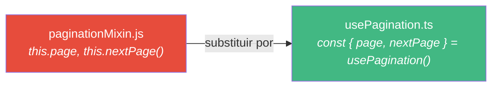

# Como Migrar a Arquitetura do Seu Projeto

::: info Nota sobre Framework
Este tutorial usa o **pack Vue 3** como exemplo. O fluxo de migracao (`@migrator` processo de 6 fases) funciona com qualquer framework pack.
:::

Este guia acompanha voce na migracao de um **projeto Vue legado** para a arquitetura Specialist Agent. Ele cobre o cenario realista de um projeto com tudo em `views/`, Options API, JavaScript, sem tipagem, Vuex e mixins.

## Antes vs Depois



## A Abordagem em 6 Fases


::: warning Ordem de baixo para cima
Sempre migre de baixo para cima: types → adapters → services → composables → componentes. Dessa forma, cada camada ja tem sua dependencia migrada.
:::

---

## Fase 1 - Diagnostico

Antes de tocar em qualquer codigo, **mapeie o que existe**. Use o agente reviewer:

```bash
"Use @reviewer to explore src/views/products/"
```

Ou faca manualmente. Responda estas perguntas:

### Checklist de inventario

| Pergunta | Como verificar | Sua resposta |
|----------|---------------|--------------|
| Quantos arquivos? | `find src/ -name "*.vue" -o -name "*.js" -o -name "*.ts" \| wc -l` | |
| Options API ou setup? | Busque por `export default {` vs `<script setup` | |
| JavaScript ou TypeScript? | Conte arquivos `.js` vs `.ts` | |
| Vuex ou Pinia? | Busque por `import { mapGetters` ou `useStore` | |
| Mixins? | Busque por `mixins:` nos componentes | |
| Chamadas API nos componentes? | Busque por `axios` ou `fetch` em arquivos `.vue` | |
| Componentes > 200 linhas? | Verifique o tamanho de cada arquivo `.vue` | |
| Imports entre modulos? | Busque imports entre pastas de features | |

### Exemplo de saida do diagnostico

```text
Modulo de Produtos:
├── views/Products.vue          (1247 linhas, Options API, JS)
├── views/ProductDetail.vue     (823 linhas, Options API, JS, usa 2 mixins)
├── store/products.js           (Vuex - chamadas API + mutations + getters)
├── mixins/paginationMixin.js   (logica compartilhada de paginacao)
├── mixins/filtersMixin.js      (logica compartilhada de filtros)
└── api/products.js             (chamadas axios, alguma transformacao)

Problemas encontrados:
- 2 componentes > 200 linhas
- Chamadas API misturadas com gerenciamento de estado (Vuex actions)
- Transformacao de dados nos Vuex getters (deveria estar no adapter)
- Mixins usados para logica compartilhada (deveriam ser composables)
- Sem TypeScript, sem props/emits tipados
- Imports cruzados entre products/ e orders/
```

---

## Fase 2 - Criar a Estrutura Alvo

Crie o esqueleto do modulo. Nao mova arquivos ainda.

```bash
mkdir -p src/modules/products/{types,adapters,services,composables,stores,components,views,__tests__}
touch src/modules/products/index.ts
```

### Validacao

A estrutura de diretorios existe e segue a convencao.

---

## Fase 3 - Extrair Types e Adapters

E aqui que a migracao **comeca a gerar valor**. Voce esta criando o contrato tipado pela primeira vez.

### 3.1 - Estudar as respostas da API

Abra a aba de rede, acesse os endpoints, copie o JSON:

```json
// GET /api/products → como e a resposta?
{
  "id": 42,
  "product_name": "Wireless Mouse",
  "price_in_cents": 2999,
  "is_active": true,
  "created_at": "2025-01-15T10:30:00Z"
}
```

### 3.2 - Criar o arquivo de types

```typescript
// src/modules/products/types/products.types.ts
export interface ProductResponse {
  id: number
  product_name: string
  price_in_cents: number
  is_active: boolean
  created_at: string
}
```

### 3.3 - Criar o arquivo de contracts

```typescript
// src/modules/products/types/products.contracts.ts
export interface Product {
  id: number
  name: string
  price: number         // em reais/dolares, nao centavos
  isActive: boolean
  createdAt: Date
}
```

### 3.4 - Criar o adapter

```typescript
// src/modules/products/adapters/products-adapter.ts
import type { ProductResponse } from '../types/products.types'
import type { Product } from '../types/products.contracts'

export const productsAdapter = {
  toProduct(response: ProductResponse): Product {
    return {
      id: response.id,
      name: response.product_name,
      price: response.price_in_cents / 100,
      isActive: response.is_active,
      createdAt: new Date(response.created_at),
    }
  },
}
```

### Validacao

```bash
npx tsc --noEmit  # Types compilam sem erros
```

---

## Fase 4 - Extrair Services

Encontre todas as chamadas de API no codigo legado e mova-as para um service puro.

### Antes (no Vuex)

```javascript
// store/products.js (LEGADO)
actions: {
  async fetchProducts({ commit }, { page, search }) {
    try {
      commit('SET_LOADING', true)
      const response = await axios.get('/api/products', { params: { page, search } })
      const products = response.data.map(p => ({
        ...p,
        name: p.product_name,        // transformacao aqui
        price: p.price_in_cents / 100 // transformacao aqui
      }))
      commit('SET_PRODUCTS', products)
    } catch (error) {
      commit('SET_ERROR', error.message)  // tratamento de erro aqui
    } finally {
      commit('SET_LOADING', false)
    }
  }
}
```

### Depois (service puro)

```typescript
// src/modules/products/services/products-service.ts
import { api } from '@/shared/services/api-client'
import type { ProductResponse } from '../types/products.types'

export const productsService = {
  list(params: { page: number; search?: string }) {
    return api.get<{ data: ProductResponse[] }>('/api/products', { params })
  },
}
```

**O que foi removido:**
- `try/catch` → tratado pelo Vue Query no composable
- `commit('SET_LOADING')` → Vue Query fornece `isLoading`
- `data.map(p => ...)` → adapter cuida da transformacao
- `commit('SET_PRODUCTS')` → Vue Query faz cache dos dados

### Validacao

O service tem apenas chamadas HTTP, sem try/catch, sem transformacao.

---

## Fase 5 - Migrar o Estado

### Dividir Vuex em Pinia + Vue Query



### Antes (Vuex)

```javascript
// store/products.js (LEGADO)
export default {
  state: {
    products: [],           // → Vue Query
    loading: false,         // → Vue Query (isLoading)
    error: null,            // → Vue Query (error)
    selectedCategory: null, // → Pinia
    searchQuery: '',        // → Pinia
    currentPage: 1,         // → Pinia
  },
  // ...
}
```

### Depois - Composable (estado do servidor)

```typescript
// src/modules/products/composables/useProductsList.ts
import { computed, type MaybeRef, toValue } from 'vue'
import { useQuery, keepPreviousData } from '@tanstack/vue-query'
import { productsService } from '../services/products-service'
import { productsAdapter } from '../adapters/products-adapter'

export function useProductsList(options: {
  page: MaybeRef<number>
  search?: MaybeRef<string>
}) {
  const { data, isLoading, error } = useQuery({
    queryKey: computed(() => ['products', 'list', {
      page: toValue(options.page),
      search: toValue(options.search),
    }]),
    queryFn: async () => {
      const response = await productsService.list({
        page: toValue(options.page),
        search: toValue(options.search),
      })
      return response.data.data.map(productsAdapter.toProduct)
    },
    staleTime: 5 * 60 * 1000,
    placeholderData: keepPreviousData,
  })

  return {
    items: computed(() => data.value ?? []),
    isLoading,
    error,
  }
}
```

### Depois - Store (estado do cliente)

```typescript
// src/modules/products/stores/products-store.ts
import { defineStore } from 'pinia'
import { ref, readonly } from 'vue'

export const useProductsStore = defineStore('products', () => {
  const searchQuery = ref('')
  const selectedCategory = ref<string | undefined>(undefined)
  const currentPage = ref(1)

  function setSearch(query: string) {
    searchQuery.value = query
    currentPage.value = 1
  }

  return {
    searchQuery: readonly(searchQuery),
    selectedCategory: readonly(selectedCategory),
    currentPage: readonly(currentPage),
    setSearch,
  }
})
```

### Substituir Mixins por Composables



```typescript
// src/shared/composables/usePagination.ts
import { ref, computed } from 'vue'

export function usePagination(initialPage = 1) {
  const currentPage = ref(initialPage)

  function nextPage() { currentPage.value++ }
  function prevPage() { if (currentPage.value > 1) currentPage.value-- }
  function goToPage(page: number) { currentPage.value = page }

  return { currentPage, nextPage, prevPage, goToPage }
}
```

### Validacao

Vuex removido do modulo, Pinia + Vue Query funcionando, mixins substituidos.

---

## Fase 6 - Converter Componentes

### Antes (Options API, 1200+ linhas)

```vue
<script>
import { mapGetters, mapActions } from 'vuex'
import paginationMixin from '@/mixins/paginationMixin'
import filtersMixin from '@/mixins/filtersMixin'

export default {
  mixins: [paginationMixin, filtersMixin],
  computed: {
    ...mapGetters('products', ['allProducts', 'isLoading']),
    filteredProducts() {
      return this.allProducts.filter(p =>
        p.name.includes(this.searchQuery)
      )
    },
  },
  methods: {
    ...mapActions('products', ['fetchProducts', 'deleteProduct']),
  },
  mounted() {
    this.fetchProducts()
  },
}
</script>
```

### Depois (script setup, < 200 linhas)

```vue
<script setup lang="ts">
import { storeToRefs } from 'pinia'
import { useProductsStore } from '../stores/products-store'
import { useProductsList } from '../composables/useProductsList'
import ProductsTable from '../components/ProductsTable.vue'
import ProductSearch from '../components/ProductSearch.vue'
import AppPagination from '@/shared/components/AppPagination.vue'

const store = useProductsStore()
const { searchQuery, currentPage } = storeToRefs(store)

const { items, isLoading } = useProductsList({
  page: currentPage,
  search: searchQuery,
})
</script>

<template>
  <div class="products-view">
    <h1>Produtos</h1>
    <ProductSearch v-model="searchQuery" @update:model-value="store.setSearch" />
    <ProductsTable :products="items" :loading="isLoading" />
    <AppPagination :current-page="currentPage" :total-pages="10" @change="store.setPage" />
  </div>
</template>
```

**O que mudou:**
- 1200 linhas → ~30 linhas (view) + componentes pequenos
- Options API → `<script setup lang="ts">`
- Vuex mapGetters → `storeToRefs(pinia)`
- Vuex mapActions → funcoes do composable
- Mixins → composables
- Sem tipos → TypeScript completo

### Validacao

```bash
npx tsc --noEmit && npm run build && npm run test
```

---

## Checklist de Migracao

Use este checklist para cada modulo:

| Fase | Verificacao | Feito |
|------|------------|-------|
| **1. Diagnostico** | Inventariou todos os arquivos | |
| | Identificou os endpoints da API | |
| | Contou Options vs setup, JS vs TS | |
| **2. Estrutura** | Diretorio do modulo criado | |
| **3. Types** | `.types.ts` espelha a API exatamente | |
| | `.contracts.ts` usa camelCase | |
| | Adapter converte bidirecionalmente | |
| | `tsc --noEmit` passa | |
| **4. Services** | Apenas HTTP, sem try/catch | |
| | Sem transformacao no service | |
| **5. Estado** | Dados do servidor no Vue Query | |
| | Estado do cliente no Pinia (sintaxe setup) | |
| | Mixins substituidos por composables | |
| | Vuex removido do modulo | |
| **6. Componentes** | Todos com `<script setup lang="ts">` | |
| | Todos os componentes < 200 linhas | |
| | defineProps/defineEmits tipados | |
| | Sem imports entre modulos | |
| | Build + testes passam | |

## Usando o Agente

```bash
# Migracao completa do modulo (6 fases com portoes de aprovacao)
"Use @migrator to migrate src/legacy/products/"

# Conversao de um unico componente
"Use @migrator to convert ProductsList.vue to script setup"
```

Ou use os skills:

```bash
/migration-migrate-module src/legacy/products/
/migration-migrate-component src/views/ProductDetail.vue
```

## Dicas para Projetos Grandes

- **Migre um modulo por vez** - nao tente migrar tudo de uma so vez
- **Comece pelo modulo mais simples** - ganhe confianca antes de enfrentar os complexos
- **Mantenha o legado funcionando** - cada fase deve deixar a aplicacao funcional
- **Use feature flags** se necessario - antigo e novo podem coexistir durante a migracao
- **Teste apos cada fase** - nao espere ate o final para validar

## Proximos Passos

- [Tutorial de Modulo CRUD](/pt-BR/tutorials/crud-module) - Veja a arquitetura alvo em acao
- [Tutorial da Camada de Service](/pt-BR/tutorials/service-layer) - Mergulho profundo na camada de dados
- [Visao Geral da Arquitetura](/pt-BR/guide/architecture) - Referencia completa da arquitetura
