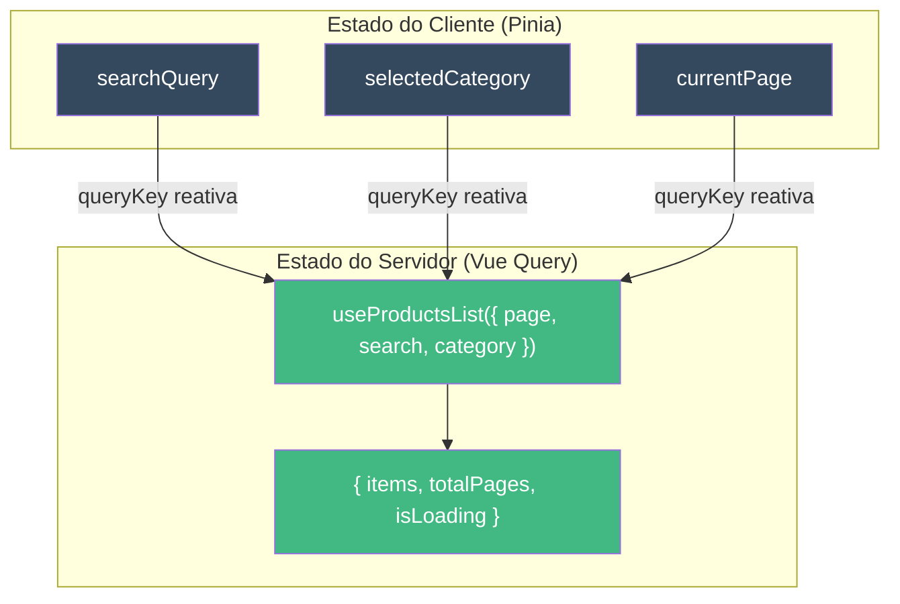
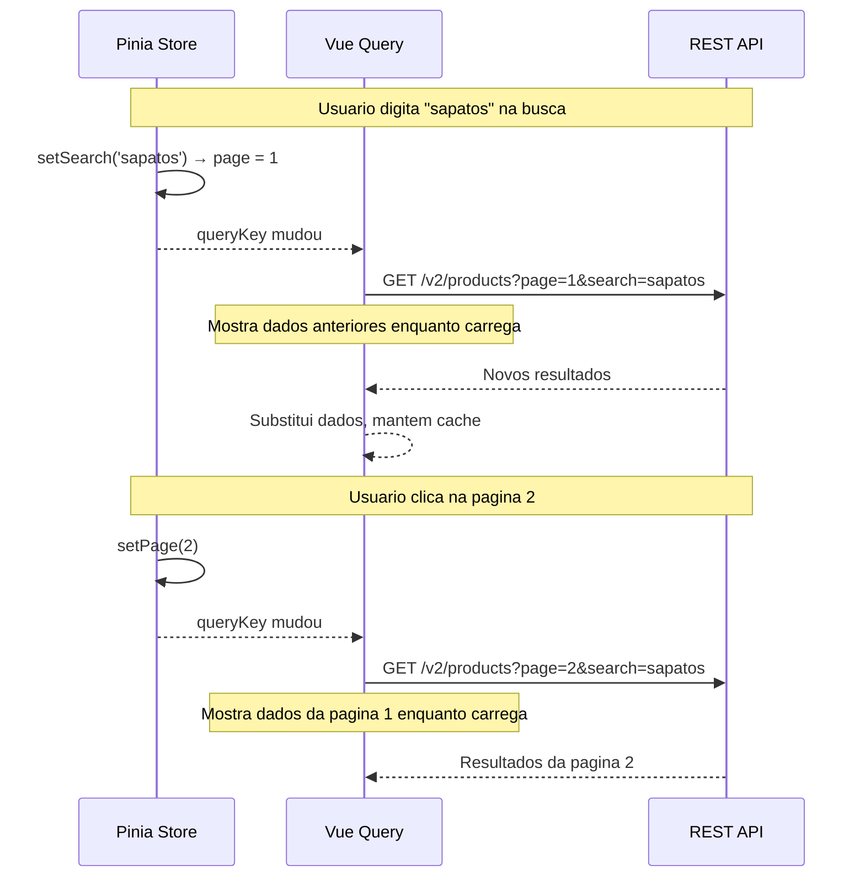
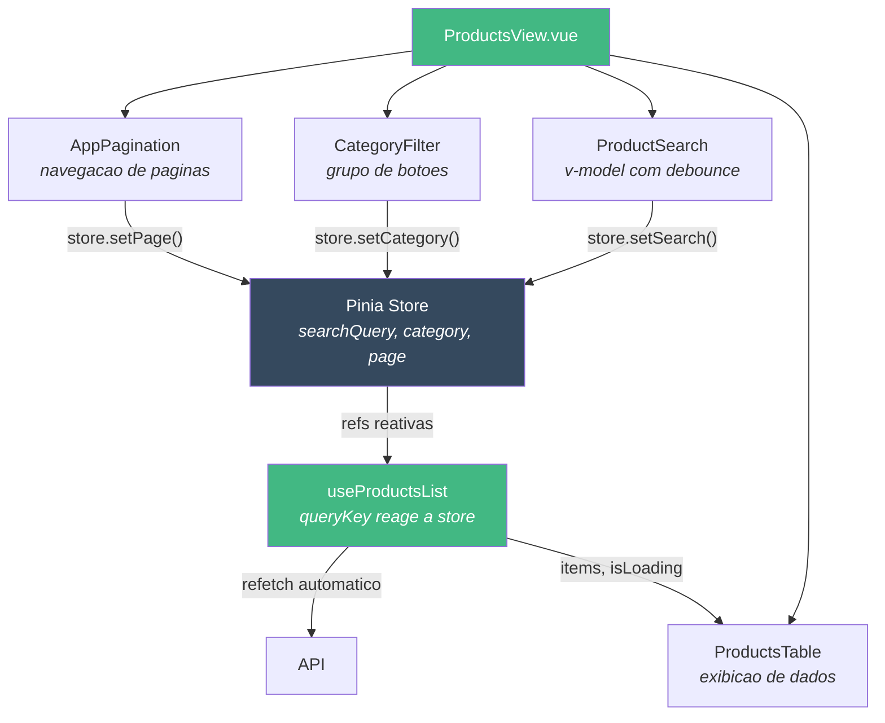

# Como Construir Paginacao com Filtros

::: info Nota sobre Framework
Os exemplos abaixo utilizam os padroes do **pack Vue 3**. Cada framework pack (React, Next.js, SvelteKit) fornece padroes equivalentes adaptados ao seu ecossistema. Veja [Framework Packs](/pt-BR/guide/introduction#como-os-packs-funcionam) para detalhes.
:::

Este tutorial mostra como construir uma **lista paginada com busca e filtros**, utilizando queries reativas com gerenciamento de estado do cliente.

## Cenario

Voce precisa de uma pagina de listagem de produtos com:
- Busca por nome do produto
- Filtro por categoria
- Paginacao (20 itens por pagina)
- UX suave ao navegar entre paginas



## Passo 1 - Store para Filtros (Estado do Cliente)

Filtros sao **estado do cliente** - nao vem do servidor. O Pinia os gerencia.

```typescript
// src/modules/products/stores/products-store.ts

import { defineStore } from 'pinia'
import { ref, computed, readonly } from 'vue'

export const useProductsStore = defineStore('products', () => {
  const searchQuery = ref('')
  const selectedCategory = ref<string | undefined>(undefined)
  const currentPage = ref(1)

  const hasActiveFilters = computed(() =>
    !!searchQuery.value || !!selectedCategory.value
  )

  function setSearch(query: string) {
    searchQuery.value = query
    currentPage.value = 1   // volta para a pagina 1 quando a busca muda
  }

  function setCategory(category: string | undefined) {
    selectedCategory.value = category
    currentPage.value = 1   // volta para a pagina 1 quando o filtro muda
  }

  function setPage(page: number) {
    currentPage.value = page
  }

  function clearFilters() {
    searchQuery.value = ''
    selectedCategory.value = undefined
    currentPage.value = 1
  }

  return {
    searchQuery: readonly(searchQuery),
    selectedCategory: readonly(selectedCategory),
    currentPage: readonly(currentPage),
    hasActiveFilters,
    setSearch,
    setCategory,
    setPage,
    clearFilters,
  }
})
```

::: tip Por que Pinia e nao apenas refs?
O Pinia persiste o estado dos filtros quando o usuario navega para outra pagina e volta. Com refs locais, o usuario perde os filtros a cada mudanca de rota.
:::

## Passo 2 - Composable com Query Reativa

O composable cria uma **queryKey reativa** - quando qualquer filtro muda, o Vue Query refaz a busca automaticamente.

```typescript
// src/modules/products/composables/useProductsList.ts

import { computed, type MaybeRef, toValue } from 'vue'
import { useQuery, keepPreviousData } from '@tanstack/vue-query'
import { productsService } from '../services/products-service'
import { productsAdapter } from '../adapters/products-adapter'

export function useProductsList(options: {
  page: MaybeRef<number>
  pageSize?: MaybeRef<number>
  search?: MaybeRef<string>
  category?: MaybeRef<string | undefined>
}) {
  const page = computed(() => toValue(options.page))
  const pageSize = computed(() => toValue(options.pageSize) ?? 20)
  const search = computed(() => toValue(options.search) ?? '')
  const category = computed(() => toValue(options.category))

  const { data, isLoading, isFetching, error } = useQuery({
    queryKey: computed(() => ['products', 'list', {
      page: page.value,
      pageSize: pageSize.value,
      search: search.value,
      category: category.value,
    }]),
    queryFn: async () => {
      const response = await productsService.list({
        page: page.value,
        pageSize: pageSize.value,
        search: search.value,
        category: category.value,
      })
      return productsAdapter.toProductList(response.data)
    },
    staleTime: 5 * 60 * 1000,
    placeholderData: keepPreviousData,
  })

  return {
    items: computed(() => data.value?.items ?? []),
    totalPages: computed(() => data.value?.totalPages ?? 0),
    totalCount: computed(() => data.value?.totalCount ?? 0),
    isEmpty: computed(() => !isLoading.value && (data.value?.items.length ?? 0) === 0),
    isLoading,
    isFetching,
    error,
  }
}
```

### Padroes-chave explicados

**`keepPreviousData`** - Enquanto busca a pagina 2, o usuario ainda ve os dados da pagina 1. Sem isso, a lista pisca vazia a cada mudanca de pagina.

**`staleTime: 5 * 60 * 1000`** - Se o usuario vai para a pagina 2 e volta para a pagina 1 em menos de 5 minutos, nao refaz a busca (usa o cache).

**`queryKey` reativa** - Quando `page`, `search` ou `category` mudam, o Vue Query detecta uma nova key e busca automaticamente. Voce nao precisa chamar `refetch()`.



## Passo 3 - Campo de Busca com Debounce

Nao faca chamadas a API a cada tecla digitada. Use uma busca com debounce.

```vue
<!-- src/modules/products/components/ProductSearch.vue -->
<script setup lang="ts">
import { ref, watch } from 'vue'

const props = defineProps<{
  modelValue: string
}>()

const emit = defineEmits<{
  'update:modelValue': [value: string]
}>()

const localSearch = ref(props.modelValue)
let debounceTimer: ReturnType<typeof setTimeout>

watch(localSearch, (value) => {
  clearTimeout(debounceTimer)
  debounceTimer = setTimeout(() => {
    emit('update:modelValue', value)
  }, 300)
})
</script>

<template>
  <input
    v-model="localSearch"
    type="search"
    placeholder="Buscar produtos..."
  />
</template>
```

## Passo 4 - Filtro de Categoria

```vue
<!-- src/modules/products/components/CategoryFilter.vue -->
<script setup lang="ts">

defineProps<{
  selected?: string
  categories: Array<{ value: string; label: string }>
}>()

const emit = defineEmits<{
  change: [category: string | undefined]
}>()
</script>

<template>
  <div class="category-filter">
    <button
      :class="{ active: !selected }"
      @click="emit('change', undefined)"
    >
      Todos
    </button>
    <button
      v-for="cat in categories"
      :key="cat.value"
      :class="{ active: selected === cat.value }"
      @click="emit('change', cat.value)"
    >
      {{ cat.label }}
    </button>
  </div>
</template>
```

## Passo 5 - Componente de Paginacao

```vue
<!-- src/shared/components/AppPagination.vue -->
<script setup lang="ts">
import { computed } from 'vue'

const props = defineProps<{
  currentPage: number
  totalPages: number
}>()

const emit = defineEmits<{
  change: [page: number]
}>()

const pages = computed(() => {
  const range: number[] = []
  const start = Math.max(1, props.currentPage - 2)
  const end = Math.min(props.totalPages, props.currentPage + 2)
  for (let i = start; i <= end; i++) range.push(i)
  return range
})
</script>

<template>
  <nav v-if="totalPages > 1" class="pagination">
    <button
      :disabled="currentPage <= 1"
      @click="emit('change', currentPage - 1)"
    >
      Anterior
    </button>

    <button
      v-for="p in pages"
      :key="p"
      :class="{ active: p === currentPage }"
      @click="emit('change', p)"
    >
      {{ p }}
    </button>

    <button
      :disabled="currentPage >= totalPages"
      @click="emit('change', currentPage + 1)"
    >
      Proximo
    </button>
  </nav>
</template>
```

## Passo 6 - A View (Compondo Tudo)

```vue
<!-- src/modules/products/views/ProductsView.vue -->
<script setup lang="ts">
import { storeToRefs } from 'pinia'
import { useProductsStore } from '../stores/products-store'
import { useProductsList } from '../composables/useProductsList'
import ProductSearch from '../components/ProductSearch.vue'
import CategoryFilter from '../components/CategoryFilter.vue'
import ProductsTable from '../components/ProductsTable.vue'
import AppPagination from '@/shared/components/AppPagination.vue'

const store = useProductsStore()
const { searchQuery, selectedCategory, currentPage, hasActiveFilters } = storeToRefs(store)

const { items, totalPages, totalCount, isLoading, isFetching, isEmpty } = useProductsList({
  page: currentPage,
  search: searchQuery,
  category: selectedCategory,
})

const categories = [
  { value: 'electronics', label: 'Eletronicos' },
  { value: 'clothing', label: 'Roupas' },
  { value: 'books', label: 'Livros' },
]
</script>

<template>
  <div class="products-view">
    <header>
      <h1>Produtos ({{ totalCount }})</h1>
      <button v-if="hasActiveFilters" @click="store.clearFilters()">
        Limpar filtros
      </button>
    </header>

    <div class="filters">
      <ProductSearch v-model="searchQuery" @update:model-value="store.setSearch" />
      <CategoryFilter
        :selected="selectedCategory"
        :categories="categories"
        @change="store.setCategory"
      />
    </div>

    <!-- Indicador de carregamento para refetch em segundo plano -->
    <div v-if="isFetching && !isLoading" class="refetching">
      Atualizando...
    </div>

    <ProductsTable :products="items" :loading="isLoading" />

    <div v-if="isEmpty && hasActiveFilters" class="no-results">
      Nenhum produto corresponde aos seus filtros.
      <button @click="store.clearFilters()">Limpar filtros</button>
    </div>

    <AppPagination
      :current-page="currentPage"
      :total-pages="totalPages"
      @change="store.setPage"
    />
  </div>
</template>
```

## Como as Pecas se Conectam



## Pontos-Chave

- **Pinia Store** armazena o estado dos filtros (busca, categoria, pagina) - persiste entre navegacoes
- **Vue Query** reage a mudancas na queryKey - sem necessidade de refetch manual
- **`keepPreviousData`** mantem a pagina anterior visivel enquanto carrega a proxima
- **Voltar para a pagina 1** quando os filtros mudam - evita exibir uma pagina 5 vazia
- **Debounce na busca** - nao faca chamadas a API a cada tecla digitada

## Proximos Passos

- [Tutorial de Modulo CRUD](/pt-BR/tutorials/crud-module) - Modulo completo com formularios e mutations
- [Guia de Migracao](/pt-BR/tutorials/migrate-project) - Migre seu projeto para esta arquitetura
