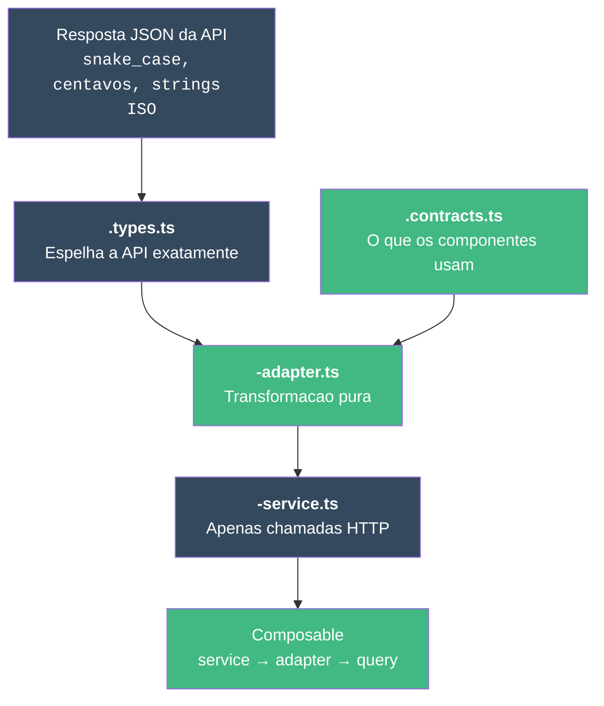

# Como Criar uma Camada de Service

::: info Nota sobre Framework
Os exemplos abaixo utilizam os padroes do **pack Vue 3**. Cada framework pack (React, Next.js, SvelteKit) fornece padroes equivalentes adaptados ao seu ecossistema. Veja [Framework Packs](/pt-BR/guide/introduction#como-os-packs-funcionam) para detalhes.
:::

Este tutorial mostra como integrar um novo endpoint de API, passo a passo. Voce construira a camada de dados completa: **types → contracts → adapter → service**.

## Cenario

Sua equipe de backend acabou de disponibilizar um novo endpoint: `GET /v3/customers`. Voce precisa integra-lo na aplicacao.

Aqui esta a resposta da API:

```json
{
  "data": [
    {
      "uuid": "cust_abc123",
      "full_name": "Jane Cooper",
      "email_address": "jane@example.com",
      "phone_number": "+1-555-0100",
      "company_name": "Acme Corp",
      "is_verified": true,
      "total_orders": 47,
      "lifetime_value_cents": 234500,
      "last_order_at": "2025-11-15T10:30:00Z",
      "created_at": "2024-03-01T08:00:00Z"
    }
  ],
  "pagination": {
    "page": 1,
    "per_page": 25,
    "total": 142
  }
}
```

## Passo 1 - Tipar a Resposta da API

Crie o arquivo de types espelhando o JSON **exatamente** - mesmos nomes de campos, mesma estrutura.

```typescript
// src/modules/customers/types/customers.types.ts

export interface CustomerResponse {
  uuid: string
  full_name: string
  email_address: string
  phone_number: string | null
  company_name: string | null
  is_verified: boolean
  total_orders: number
  lifetime_value_cents: number
  last_order_at: string | null     // ISO 8601 ou null
  created_at: string               // ISO 8601
}

export interface CustomerListResponse {
  data: CustomerResponse[]
  pagination: {
    page: number
    per_page: number
    total: number
  }
}
```

::: tip Dica profissional
Copie a resposta JSON e depois a tipe. Nao renomeie os campos aqui - esse e o trabalho do adapter.
:::

## Passo 2 - Definir o Contrato da Aplicacao

Isto e o que seus componentes Vue vao usar. Nomes limpos, tipos adequados.

```typescript
// src/modules/customers/types/customers.contracts.ts

export interface Customer {
  id: string
  name: string
  email: string
  phone: string | null
  company: string | null
  isVerified: boolean
  totalOrders: number
  lifetimeValue: number      // em reais/dolares, nao em centavos
  lastOrderAt: Date | null
  createdAt: Date
}

export interface CustomerListResult {
  items: Customer[]
  page: number
  total: number
}
```

Observe as diferencas:

| API (`types.ts`) | App (`contracts.ts`) | Por que |
|---|---|---|
| `uuid` | `id` | Nome mais simples |
| `full_name` | `name` | Sem prefixo redundante |
| `email_address` | `email` | Mais curto |
| `lifetime_value_cents` | `lifetimeValue` | Convertido para a moeda |
| `string` para datas | Objetos `Date` | Tipo adequado |

## Passo 3 - Construir o Adapter

O adapter conecta os dois formatos. **Apenas funcoes puras.**

```typescript
// src/modules/customers/adapters/customers-adapter.ts

import type { CustomerResponse, CustomerListResponse } from '../types/customers.types'
import type { Customer, CustomerListResult } from '../types/customers.contracts'

export const customersAdapter = {
  toCustomer(response: CustomerResponse): Customer {
    return {
      id: response.uuid,
      name: response.full_name,
      email: response.email_address,
      phone: response.phone_number,
      company: response.company_name,
      isVerified: response.is_verified,
      totalOrders: response.total_orders,
      lifetimeValue: response.lifetime_value_cents / 100,
      lastOrderAt: response.last_order_at
        ? new Date(response.last_order_at)
        : null,
      createdAt: new Date(response.created_at),
    }
  },

  toCustomerList(response: CustomerListResponse): CustomerListResult {
    return {
      items: response.data.map(customersAdapter.toCustomer),
      page: response.pagination.page,
      total: response.pagination.total,
    }
  },
}
```

::: warning Trate os nulos
Sempre verifique `null` antes de converter. `response.last_order_at` pode ser `null` - o adapter deve tratar isso, nao o componente.
:::

## Passo 4 - Construir o Service

O service e a camada mais simples. Chamadas HTTP com request/response tipados. Nada mais.

```typescript
// src/modules/customers/services/customers-service.ts

import { api } from '@/shared/services/api-client'
import type { CustomerResponse, CustomerListResponse } from '../types/customers.types'

export const customersService = {
  list(params: { page?: number; perPage?: number; search?: string }) {
    return api.get<CustomerListResponse>('/v3/customers', { params })
  },

  getById(id: string) {
    return api.get<{ data: CustomerResponse }>(`/v3/customers/${id}`)
  },
}
```

**Checklist de regras:**
- Apenas chamadas HTTP
- Generics tipados em `api.get<T>`
- Sem try/catch
- Sem transformacao de dados
- Sem chamadas ao adapter

## Passo 5 - Usar em um Composable

Agora conecte tudo:

```typescript
// src/modules/customers/composables/useCustomersList.ts

import { computed, type MaybeRef, toValue } from 'vue'
import { useQuery } from '@tanstack/vue-query'
import { customersService } from '../services/customers-service'
import { customersAdapter } from '../adapters/customers-adapter'

export function useCustomersList(options: {
  page: MaybeRef<number>
  search?: MaybeRef<string>
}) {
  const page = computed(() => toValue(options.page))
  const search = computed(() => toValue(options.search) ?? '')

  const { data, isLoading, error } = useQuery({
    queryKey: computed(() => ['customers', 'list', {
      page: page.value,
      search: search.value,
    }]),
    queryFn: async () => {
      const response = await customersService.list({
        page: page.value,
        search: search.value,
      })
      return customersAdapter.toCustomerList(response.data)
    },
    staleTime: 5 * 60 * 1000,
  })

  return {
    items: computed(() => data.value?.items ?? []),
    total: computed(() => data.value?.total ?? 0),
    isLoading,
    error,
  }
}
```

## O Padrao de 4 Arquivos



## Testando o Adapter

Adapters sao a **camada mais facil de testar** - entrada/saida puras.

```typescript
// src/modules/customers/__tests__/customers-adapter.spec.ts

import { describe, it, expect } from 'vitest'
import { customersAdapter } from '../adapters/customers-adapter'

describe('customersAdapter', () => {
  const apiResponse = {
    uuid: 'cust_abc123',
    full_name: 'Jane Cooper',
    email_address: 'jane@example.com',
    phone_number: '+1-555-0100',
    company_name: 'Acme Corp',
    is_verified: true,
    total_orders: 47,
    lifetime_value_cents: 234500,
    last_order_at: '2025-11-15T10:30:00Z',
    created_at: '2024-03-01T08:00:00Z',
  }

  it('converte snake_case para camelCase', () => {
    const result = customersAdapter.toCustomer(apiResponse)
    expect(result.name).toBe('Jane Cooper')
    expect(result.email).toBe('jane@example.com')
    expect(result.isVerified).toBe(true)
  })

  it('converte centavos para a moeda', () => {
    const result = customersAdapter.toCustomer(apiResponse)
    expect(result.lifetimeValue).toBe(2345)
  })

  it('converte strings ISO para objetos Date', () => {
    const result = customersAdapter.toCustomer(apiResponse)
    expect(result.createdAt).toBeInstanceOf(Date)
    expect(result.lastOrderAt).toBeInstanceOf(Date)
  })

  it('trata datas nulas', () => {
    const result = customersAdapter.toCustomer({
      ...apiResponse,
      last_order_at: null,
    })
    expect(result.lastOrderAt).toBeNull()
  })
})
```

## Usando o Agente

```bash
"Use @builder to create the service layer for /v3/customers"
```

Ou use o skill:

```bash
/dev-create-service customers
```

## Proximos Passos

- [Tutorial de Modulo CRUD](/pt-BR/tutorials/crud-module) - Construa um modulo completo do zero
- [Tutorial de Formularios](/pt-BR/tutorials/forms) - Crie um formulario de cliente com validacao Zod
