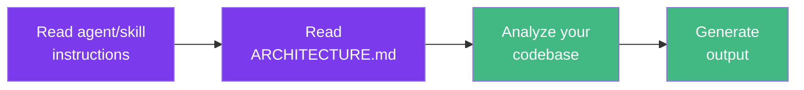

# Token Usage

Each operation has a different token cost depending on complexity. Use this table to estimate usage.

## How Tokens Are Consumed

Every time you invoke an agent or skill, Claude Code performs multiple steps - each consuming tokens:

| Step | What happens | Token impact |
|------|-------------|--------------|
| **1. Read instructions** | Claude loads the agent/skill markdown | Fixed (~1-2k) |
| **2. Read ARCHITECTURE.md** | Claude loads your architecture patterns | Fixed (~2-4k) |
| **3. Analyze codebase** | Claude reads existing files for context | Variable (depends on scope) |
| **4. Generate output** | Claude writes code, reviews, or reports | Variable (depends on complexity) |

::: info
Token counts below are **total per operation** (all 4 steps combined). Actual costs depend on the model's per-token pricing - check [Anthropic's pricing page](https://www.anthropic.com/pricing) for current rates.
:::

## Full Agents (Sonnet/Opus)

| Operation | Tokens | Notes |
|-----------|--------|-------|
| `/dev-create-component` | ~3-5k | Single component |
| `/dev-create-service` | ~5-8k | 4 files (types + contracts + adapter + service) |
| `/dev-create-composable` | ~3-5k | Single composable |
| `/dev-create-test` | ~3-8k | Depends on file complexity |
| `/dev-create-module` | ~15-25k | Full module scaffold |
| `/dev-generate-types` | ~3-5k | Types + contracts + adapter |
| `/review-check-architecture` | ~5-10k | Automated checks |
| `/review-review` | ~8-15k | Full review with automated + manual |
| `/review-fix-violations` | ~5-15k | Depends on violation count |
| `/docs-onboard` | ~3-5k | Module summary |
| `/migration-migrate-component` | ~5-10k | Single component migration |
| `/migration-migrate-module` | ~30-80k | Full module migration (6 phases) |
| `@doctor` (bug) | ~5-15k | Depends on bug complexity |
| `@explorer` (assessment) | ~10-20k | Depends on codebase size |
| `@starter` (new project) | ~15-30k | Depends on stack complexity |

## Lite Agents (Haiku)

Lite agents use `model: haiku` - significantly cheaper per token.

| Operation | Tokens | Savings vs Full |
|-----------|--------|-----------------|
| Component scaffold | ~2-3k | ~50% |
| Service layer | ~3-5k | ~40% |
| Code review | ~3-5k | ~55% |
| Module scaffold | ~5-10k | ~55% |
| Bug investigation | ~2-5k | ~50% |

## Real-World Scenarios

### Scenario 1: Build a complete CRUD module

A typical e-commerce "Orders" module from scratch:

| Step | Agent/Skill | Tokens |
|------|-------------|--------|
| Scaffold module | `/dev-create-module orders` | ~20k |
| Add form validation | `@builder` (composable + component) | ~8k |
| Write unit tests | `/dev-create-test` (3 files) | ~15k |
| Review before PR | `/review-review orders` | ~12k |
| **Total** | | **~55k** |

### Scenario 2: Review sprint (5 PRs)

End-of-sprint review session:

| Step | Agent/Skill | Tokens |
|------|-------------|--------|
| Architecture check | `/review-check-architecture` (5x) | ~35k |
| Full review (2 complex PRs) | `/review-review` (2x) | ~25k |
| Fix violations found | `/review-fix-violations` (1x) | ~10k |
| **Total** | | **~70k** |

### Scenario 3: Migrate a legacy module

Converting a Vuex + Options API module to the target architecture:

| Step | Agent/Skill | Tokens |
|------|-------------|--------|
| Assess codebase first | `@explorer` | ~15k |
| Full module migration | `/migration-migrate-module` | ~60k |
| Post-migration review | `/review-review` | ~12k |
| Fix remaining issues | `@doctor` | ~8k |
| **Total** | | **~95k** |

## When to Use Lite vs Full

| Situation | Recommendation | Why |
|-----------|---------------|-----|
| Rapid prototyping | **Lite** | Speed matters more than polish |
| Simple component scaffold | **Lite** | Low complexity, Haiku handles well |
| Quick architecture check | **Lite** | Automated checks don't need deep reasoning |
| New module from scratch | **Full** | Complex decisions need stronger model |
| PR review before merge | **Full** | Catches subtle issues Haiku might miss |
| Full module migration | **Full** | 6-phase process requires deep understanding |
| Bug investigation | **Full** | Tracing through layers needs strong reasoning |
| Iterating on a component | **Lite first**, then Full | Draft with Lite, polish with Full |

## Tips to Reduce Token Usage

1. **Scope small** - `/dev-create-component ProductCard` costs ~4k vs `/dev-create-module products` at ~20k. Only scaffold what you need.

2. **Migrate incrementally** - Use `/migration-migrate-component` (~8k per file) instead of `/migration-migrate-module` (~60k) when possible.

3. **Use Lite for iteration** - Draft with Lite agents, then run a single Full review at the end.

4. **Leverage skills over agents** - Skills like `/dev-create-service` are more focused and cheaper than asking `@builder` for the same thing.

5. **Batch reviews** - Run `/review-check-architecture` (automated, ~7k) before `/review-review` (full, ~12k). If automated passes, you may not need the full review.

::: tip Cost Optimization Summary
- Use **Lite agents** for rapid iteration and simple tasks
- Use **Full agents** for new modules, PRs, and complex migrations
- For large modules, migrate incrementally - one component at a time with `/migration-migrate-component` instead of the full module migration
:::
